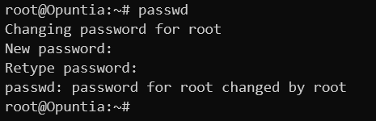

============================
Administrative Configuration
============================

.. contents:: Table of Contents

This chapter will describe configuring Opuntia systems Administrative settings. 

Changing the Password
---------------------

.. note:: Changing the password is an instant change that does not need to be applied to take effect. 

**Web GUI**

To change the root password, first navigate to the "Router Password" menu.

Main Menu - *System --> Administration*

.. image:: ../manual-images/System-Administration-Password.png
  :width: 600
  :alt: Screenshot of the Opuntia Password management screen

Input your desired password in both boxes and click save. 

**CLI**

To change the root password, you use the standard Linux "passwd" utility. Below is an example. 

Adding SSH Keys
---------------

Adding SSH authorized keys can be a convenient option when accessing an Opuntia based systems via the CLI. 

**Web GUI**

To add an authorized SSH key, first navigate to the "SSH-Keys" menu.

Main Menu - *System --> Administration* and then click the "SSH-Keys" Tab. 

.. note:: Adding a SSH-Key is an instant change that does not need to be applied to take effect. 

.. note:: Also take care when pasting the ssh key into the textbox the ssh key must be a single line of text. 

.. image:: ../manual-images/System-Administration-SSH-Keys.png
  :width: 600
  :alt: Screenshot of the SSH-Keys menu

Once a key is added you will see a summary of the key including the comment of the key. 

**CLI**

To add an authorized SSH key from the CLI you will need to edit the */etc/dropbear/authorized_keys* file. 

.. note:: The authorized key file format requires each SSH key be on a single line 

Changing the Hostname
---------------------

**Web GUI**

To change the Hostname of the system. First navigate to the General settings page. 

Main Menu - *System --> System*

Enter your desired Hostname into the Hostname textbox. Then either click "Save" or "Save & Apply" if you want the change 
to happen immediately. 

**CLI**

To change the Hostname from the CLI you can edit the */etc/config/system* file. Or use the uci utility to make the needed 
configuration change. Examples of both methods are shown below. 

.. note:: The "reload_config" command must be run after each of these methods to apply the changes.

Here you see the default contents of the system configuration (*/etc/config/system*). In the config system section of this
file you will see the option hostname. Modify this to your desired Hostname and then save the file. After saving the file,
run "reload_config" to apply the changes. 

And here is an example of the uci command needed to change the hostname to "Newhostname". ::

  uci set system.@system[0].hostname='Newhostname'

Setting Time and the Timezone
-----------------------------

**Web GUI**

To change the time or timezone of the system. First navigate to the General settings page. 

Main Menu - *System --> System*

.. note:: We recommend that you use the UTC timezone as it simplifies log aggreation from multiple systems.  

**CLI**

Here is the uci command to set the timezone. ::

  uci set system.@system[0].zonename='UTC'

Once you have used the uci command to change the timezone; run "reload_config" to apply the changes. 

