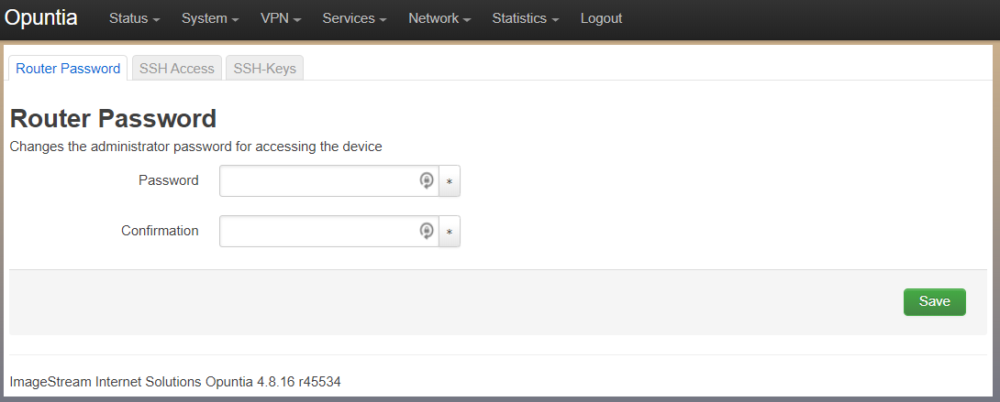
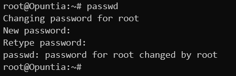
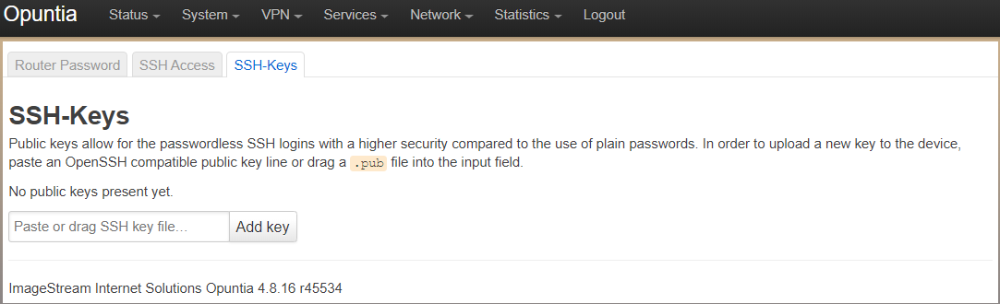

====================
Administrative Tasks
====================

.. contents:: Table of Contents

This chapter will describe configuring Opuntia systems Administrative settings. 

Changing the Password
---------------------

.. note:: Changing the password is an instant change that does not need to be applied to take effect. 

**Web GUI**

To change the root password, first navigate to the "Router Password" menu.

Main Menu - *System --> Administration*

Input your desired password in both boxes and click save. 

**CLI**

To change the root password, you use the standard Linux "passwd" utility. Below is an example. 

Adding SSH Keys
---------------

Adding SSH authorized keys can be a convenient option when accessing an Opuntia based systems via the CLI. 

**Web GUI**

To add an authorized SSH key, first navigate to the "SSH-Keys" menu.

Main Menu - *System --> Administration* and then click the "SSH-Keys" Tab. 

.. note:: Adding a SSH-Key is an instant change that does not need to be applied to take effect. 

.. note:: Also take care when pasting the ssh key into the textbox the ssh key must be a single line of text. 

Once a key is added you will see a summary 

**CLI**

To add an authorized SSH key from the CLI you will need to edit the */etc/dropbear/authorized_keys* file. If the file