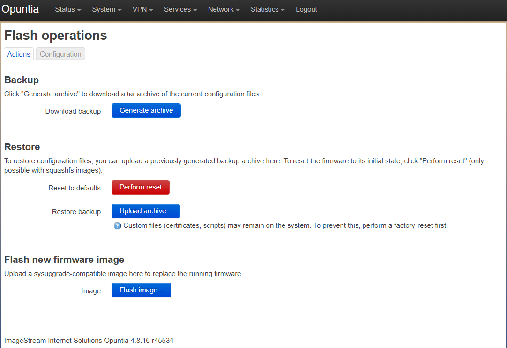
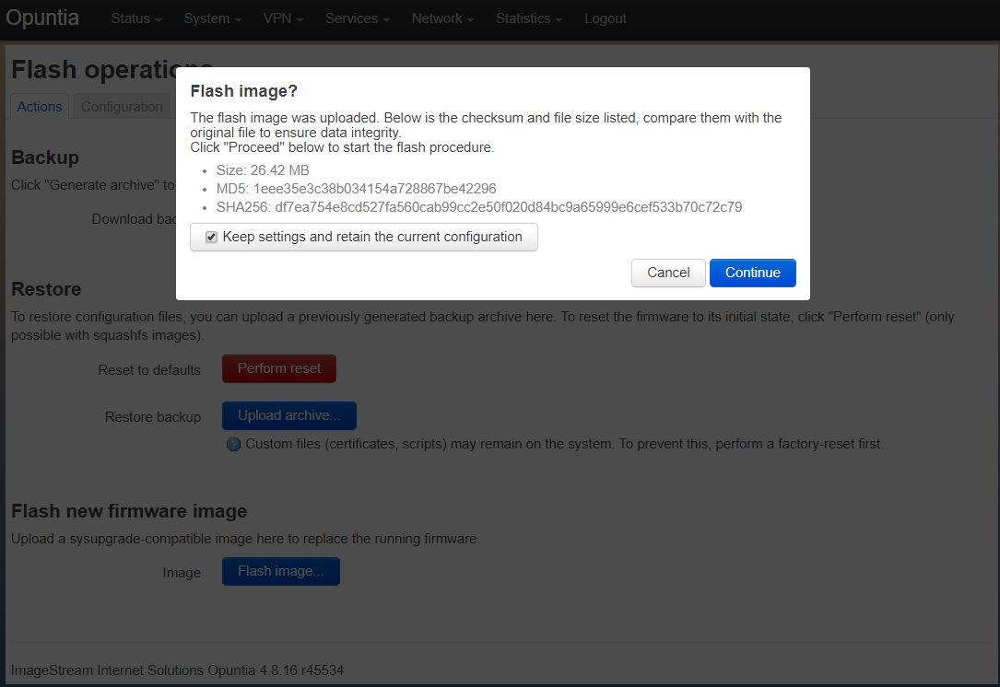
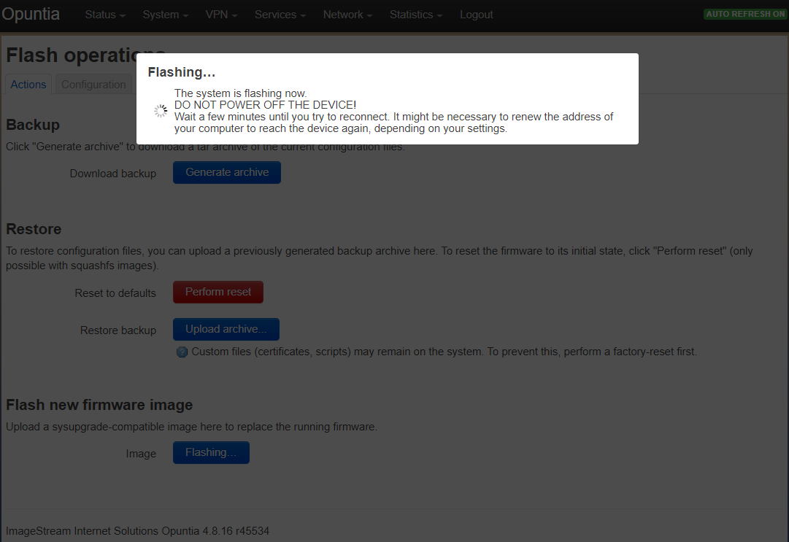

=======================
Configuration Managment
=======================

.. contents:: Table of Contents

This chapter will detail how to back-up, restore and reset to defaults of your system configuration. 

Configuration Backup
--------------------

**Web GUI**

The easiest wasy to get a backup of an Opuntia system is to use the Backup option on the "Flash operations" page.

Main Menu - *System --> Backup/Flash Firmware*

To get a backup; simply click the "Generate archive" button. This will cause the system to generate a backup file using 
the following format. "backup-<Current hostname>-<Current Date>.tar.gz". This file will be downloaded by your Web Browser.

**CLI**

The process to backup using the CLI is more involved, you first must manually generate the backup file. And then transfer 
the file off of the system. ::

  sysupgrade -b /tmp/backup-${HOSTNAME}-$(date +%F).tar.gz

This will generate a backup file that matches the same format you get when using the Web GUI method. But it is possible to
use whatever filename you wish. 

.. important:: If you do generate a backup file make sure you use the /tmp/ directory as the destination.  

.. image:: ../manual-images/Backup-CLI.png
  :width: 500
  :alt: Screenshot of a manual backup on the CLI.

Once you have created a backup image you must transfer it off of the system. The simplest way to do this is to use the 
"scp" command. This allows you to transfer the image off of the system and to a remote host. 

Restoring Configurations
------------------------

**Web GUI**

To restore the system from a downloaded configuration file, first navigate to the "Flash operations" page. 

Main Menu - *System --> Backup/Flash Firmware*

There are two options for restoring the system. You can restore from a saved backup file or you can restore the system
to the default configuration. We will cover both operations in this section. 

To restore from a saved backup; you begin by first uploading the backup file to the Opuntia system. This is done by clicking
the "Upload archive" button. This brings up a local file browser. You need to select your desired backup file. Once selected
you will see the following upload summary dialog box. That will show your filename and size of the configuration file. Click
upload to be the upload process. 

.. image:: ../manual-images/System-Backup-uploading.png
  :width: 600
  :alt: Screenshot of the backup uploading

Once the backup configuration file is uploaded, you will see a detailed list of all of the files contained in the backup
configuration file. You will need to scroll to the bottom of the list to see the contine button. 

.. image:: ../manual-images/System-Backup-restore.png
  :width: 600
  :alt: Screenshot of the backup restore confermation page

Once the contiue button is pressed the system will reboot. If the URL does not change, the Web GUI will reconnect after 
the reboot process is complete. 

.. note:: The configuration can change the ip address of the system so you may have to reconnect to a different url. 

This completes restoring a saved configuration file. 

To restore the system to a default state it is needed to click on the "Perform reset" button. And then to conferm that you 
want to restore to factory defaults. This then performs a system reboot. 

**CLI**

To restore a saved backup configuration file using the command line interface you must first upload the file to the system.
The recommended method is to use "scp" to upload the file. 

.. important:: If you are manual uploading configuration files to a system you must use the /tmp directory as the destination for the file.

Covering all the options of the scp command is beyond the scope of this manual. But this command line and example will work 
for most situations. This example assumes that the filename of the backup file is "backup-Opuntia-2020-04-09.tar.gz" and the 
Opuntia system has an ip address of 192.168.79.14 ::

  scp backup-Opuntia-2020-04-09.tar.gz root@192.168.79.14:/tmp/

To restore from the uploaded use the following command. If you do not wish to reboot immediately remove the "reboot" from 
the end of this example. ::

  sysupgrade -r /tmp/backup-Opuntia-2020-04-09.tar.gz ; sync ; reboot

.. image:: ../manual-images/System-Restore-reboot-CLI.png
  :width: 600
  :alt: Screenshot showing a system restore and reboot from the CLI.

Upgrading the OS 
----------------

**Web GUI**

Upgrading the Firmware on an Opuntia system is easy from the Web GUI. You will be given the option to save the current 
configuration after the firmware update. This is the default option. 

.. warning:: When upgrading between major versions, configuration settings are not guaranteed to be compatible between major versions. 

Navigate to the "Backup/Flash Firmware" page to get started on the upgrade process. 

Main Menu - *System --> Backup/Flash Firmware*

ImageStream posts our current firmware at the following site. 

.. note:: Take care when downloading firmware: the firmware image must match your hardware configuration

`Opuntia Firmware Download Site <http://router-updates.imagestream.com/opuntia/>`_ 

The firmware has a standard filename format to help identify the correct firmware image for a specifc hardware platform.

<Os-name>-<Hardware Platform>-<Major Release>-<release tag>-<factory/sysupgrade>.img 

For example: opuntia-EV1000-4.8.16-r45534-sysupgrade.bin is an Opuntia image for the EV1000 hardware. The major OS version
is 4.8.16 and it has a release tag of r45534. This is a system upgrade image that if installed will upgrate the OS on 
the EV1000 to 4.8.16.

Once you have identified the correct firmware file and have downloaded the file click the "Flash image" button to bring up 
a local file browser. Then select to the correct firmware file. This file will be uploaded to the system. After the upload 
is finished you will see the "flash confirmation dialog box". You will see the firmware size, MD5 and SHA256 hash values. 

.. note:: The firmware update can change the ip address of the system so you may have to reconnect to a different url. 

After clicking contine the system will begin flashing.

.. warning:: DO NOT POWER off the system while the firmware upgrade process is running. Failure to do so may result in the system being unable to boot.

