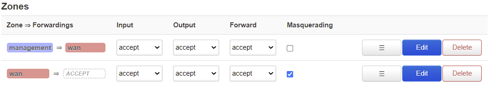

======================
Firewall configuration
======================

.. contents:: Table of Contents

This chapter covers Firewall configuration and theory for Opuntia systems. Opuntia is a Linux based operating system. The 
firewall subsystem uses the standard Linux Netfilter project tools and methods to provide IPv4 and IPv6 packet filtering. 

Major features of Netfilter

* Stateless Packet Filtering
* Statefull Packet Filtering
* Network Address Translation
* Port Address Translation

In this section of the Opuntia manual we will provide examples of using these features. As a reveiw here is general packet flow
through the Linux Netfilter chains and tables.

.. image:: ../manual-images/Netfilter-packet-flow.svg
  :width: 700
  :alt: Packet Flow in Linux Netfilter

.. _Firewall-Zone-based:

Zone based Firewall Theory
--------------------------

The standard Linux firewalling features can result in long and repetitive configuraions if you want a rule to apply to multiple
interfaces. To help overcome these issues, Opuntia implments Zone based firewalling. Zones allow you to group multiple interfaces
into a Zone and then apply a single firewall rule to the Zone. This simplifies the configuraion of the firewall ruleset by 
reducing the total number of rules. 

Opuntia implments two Zones by default *Management* and *Wan*. 

Depending on your hardware platform; interfaces may be included in the *Wan* or *Management* zones by default. See your QuickStart
Guide for more information. 

By default Opuntia allows access to the Web GUI on ANY IPv4/IPv6 interface address. The 

Firewall Configuration
----------------------

To navigate to the Firewall configuraion page. 

Main Menu - *Network --> Firewall*

General Settings
################

.. image:: ../manual-images/Firewall-Gereral-Settings.png
  :width: 600
  :alt: The main Firewall General Settings page

The Firewall *General Settings* tab has three main sections. 

* General Settings
* Routing/Nat Offloading
* Zones

General Settings
****************

I know it's odd that the GUI tab is "General Settings" and there is a subsection that is also named "General Settings" but this
is how the GUI organizes these settings. There are two settings in this section. *Enable Syn-Flood Protection* and *Drop Invalid 
Packets*. Syn-Flood Protection is enabled by default on all Opuntia platforms. This option is unlikely to cause any issues. 

The *Drop Invalid Packets* option is not enabled by default on any Opuntia platform. This option creates a series of firewall 
rules that aim to drop invalid packets flowing through the system. This is often a safe option to enable. The most impactful rule
that this option creates is a rule to drop packets that are not known in the Netfilter conntrack table. 

In most cases where there is a only a single Internet gateway this configuraion is acceptable. But if any Multi-Path Routing is 
being used; this option will cause packet loss and interrupted connections. So take care if you decide to enable this 
configuraion and you have Multi-Path Routing. 

Additionally there are the three default policy selections in this section. The by default Opuntia has these all set to accept. 
It's possible to change these options but it should be done with care if you modify the INPUT or FORWARD chain. 

Routing/Nat Offloading
**********************

This section has two options. *Software flow Offloading* and if you enable that option you will also see the *Hardware flow Offloading* 
option. These options can allow you to lower cpu usage by bypassing some of the default Netfilter packet processing for known 
packet flows. This can sometimes cause issues with applications. So these are not enabled by default. 

Zones
*****

This section descibes the mapping of relationships of the firewall zones to default packet policy in these zones. Here is a 
detailed screenshot of the zones section. 

Here you see the two default zones that are configured in Opuntia. The *Wan* and *Management* zones.

Looking at the *Management* zone, You can see the arrow indicating the direction of the traffic. From the *Management* zone 
to the *Wan* zone. 

.. _Firewall-Limiting-External-access:

Limiting External access
------------------------

By default Opuntia is permisive with access to local services like the Web GUI and ssh login. While very useful for allowing 
administrator access to the equipment; this can be a security risk. This section of the manual will detail how to remove some of 
the default firewall rules that allow access to these services from remote. 

