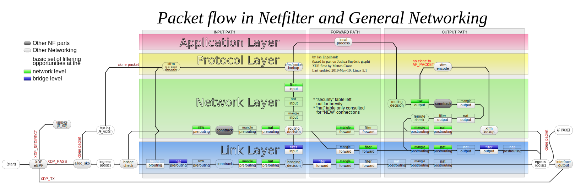
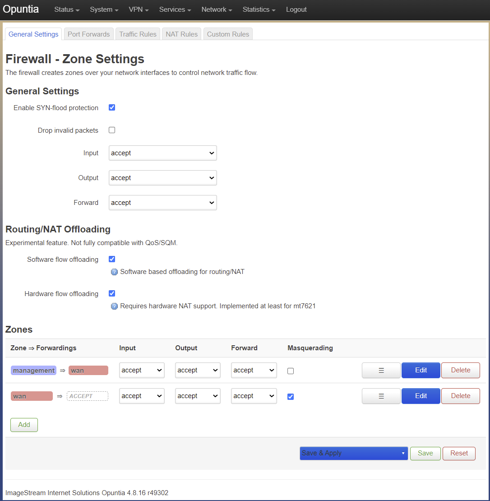

======================
Firewall configuration
======================

.. contents:: Table of Contents

This chapter covers Firewall configuration and theory for Opuntia systems. Opuntia is a Linux based operating system. The 
firewall subsystem uses the standard Linux Netfilter project tools and methods to provide IPv4 and IPv6 packet filtering. 

Major features of Netfilter

* Stateless Packet Filtering
* Statefull Packet Filtering
* Network Address Translation
* Port Address Translation

In this section of the Opuntia manual we will provide examples of using these features. As a reveiw here is general packet flow
through the Linux Netfilter chains and tables.

.. _Firewall-Zone-based:

Zone based Firewall Theory
--------------------------

The standard Linux firewalling features can result in long and repetitive configuraions if you want a rule to apply to multiple
interfaces. To help overcome these issues, Opuntia implments Zone based firewalling. Zones allow you to group multiple interfaces
into a Zone and then apply a single firewall rule to the Zone. This simplifies the configuraion of the firewall ruleset by 
reducing the total number of rules. 

Opuntia implments two Zones by default *Managment* and *Wan*. 

Depending on your hardware platform; interfaces may be included in the *Wan* or *Managment* zones by default. See your QuickStart
Guide for more information. 

By default Opuntia allows access to the Web GUI on ANY IPv4/IPv6 interface address. The 

Firewall Configuration
----------------------

To navigate to the Firewall configuraion page. 

Main Menu - *Network --> Firewall*

General Settings
################

The Firewall *General Settings* tab has three main sections. 

* General Settings
* Routing/Nat Offloading
* Zones
  

.. _Firewall-Limiting-External-access:

Limiting External access
------------------------

By default Opuntia is permisive with access to local services like the Web GUI and ssh login. While very useful for allowing 
administrator access to the equipment; this can be a security risk. This section of the manual will detail how to remove some of 
the default firewall rules that allow access to these services from remote. 

