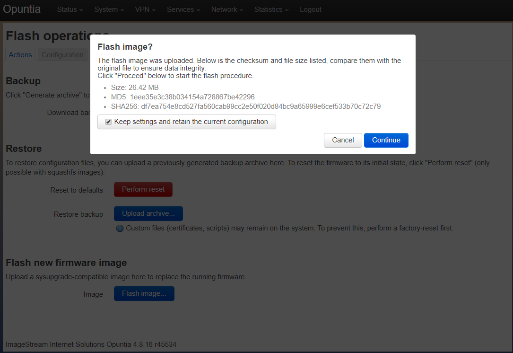
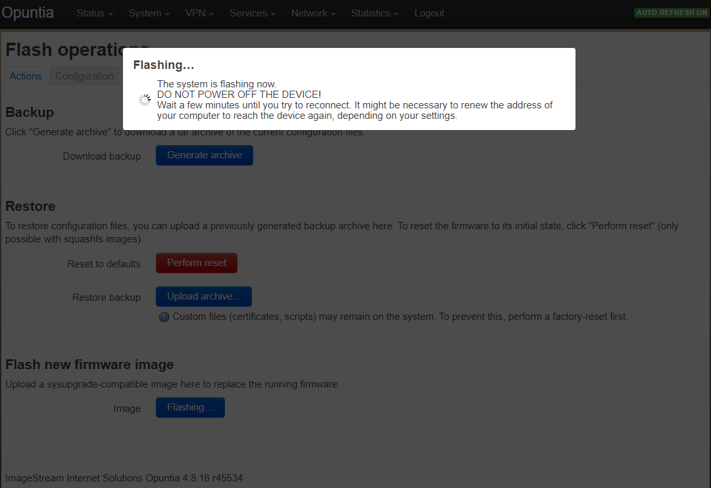

==========================
Operating System Managment
==========================

.. contents:: Table of Contents

Firmware file format
--------------------

The firmware has a standard filename format to help identify the correct firmware image for a specifc hardware platform.

<Os-name>-<Model name>-<Hardware version>-<Major Release>-<release tag>-<factory/sysupgrade>.img 

For example: opuntia-EV1000-v4-4.8.17-r51455-sysupgrade.bin is an Opuntia image for the EV1000 hardware version 4. The major 
OS release is 4.8.17 and it has a release tag of r51455. This is a system upgrade image that if installed will upgrate the 
OS on the EV1000 to 4.8.17.

Opuntia firmware is available at the following website. We  

`Opuntia Firmware Download Site <http://router-updates.imagestream.com/opuntia/>`_ 

.. warning:: Take care when downloading firmware: the firmware image must match your hardware platform and device type. Failure to do so will result in sadness and a bricked device.

Upgrading the OS 
----------------

Opuntia supports several different hardware platforms, at the current time Opuntia nativily runs on x86, Arm64 and Mips 
systems. Please consult your hardware quickstart guide.

Web GUI
#######

Upgrading the Firmware on an Opuntia system is easy from the Web GUI. You will be given the option to save the current 
configuration after the firmware update. This is the default option. 

.. warning:: When upgrading between major versions, configuration settings are not guaranteed to be compatible. 

Navigate to the "Backup/Flash Firmware" page to get started on the upgrade process. 

Main Menu - *System --> Backup/Flash Firmware*

.. image:: ../manual-images/System-Backup.png
  :width: 600
  :alt: The Backup/Restore and flash page

Verify that you have the correct firmware file for your hardware platform. Then click the "Flash image" button to bring up 
a local file browser. Then select to the correct firmware file. This file will be uploaded to the system. After the upload 
is finished you will see the "flash confirmation dialog box". You will see the firmware size, MD5 and SHA256 hash values. 

.. note:: The firmware update can change the ip address of the system so you may have to reconnect to a different url. 

After clicking contine the system will begin flashing.

.. warning:: DO NOT POWER off the system while the firmware upgrade process is running. Failure to do so may result in the system being unable to boot.

CLI
###

Upgrading the firmware from the command line is not difficult. The major complication is getting the firmware to the 
device and insuring that you do not fill the limited space that is available on the filesystem.

.. warning:: When transfering your new firmware image to a router store it in the /tmp directory

Be sure to select the correct firmware image. If you are upgrading the system and want to keep current settings use a 
"sysupgrade" image. In the example below we are upgrading an EV1000 v4 router using the 4.8.18 sysupgrade firmware.  

Assuming you have transfered your new firmware image to the router; you can now use the sysupgrade command to flash the 
firmware. 

  sysupgrade -v /tmp/opuntia-EV1000-v4-4.8.18-r58415-sysupgrade.bin

