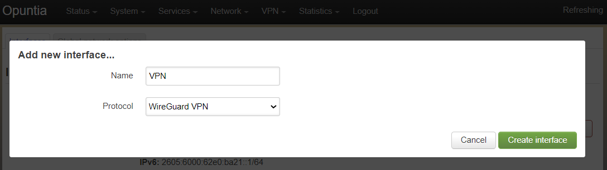
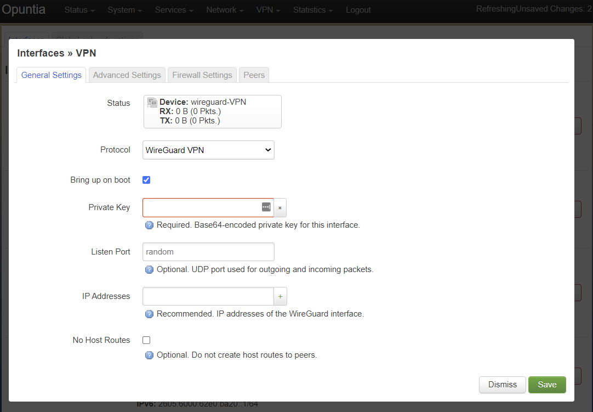
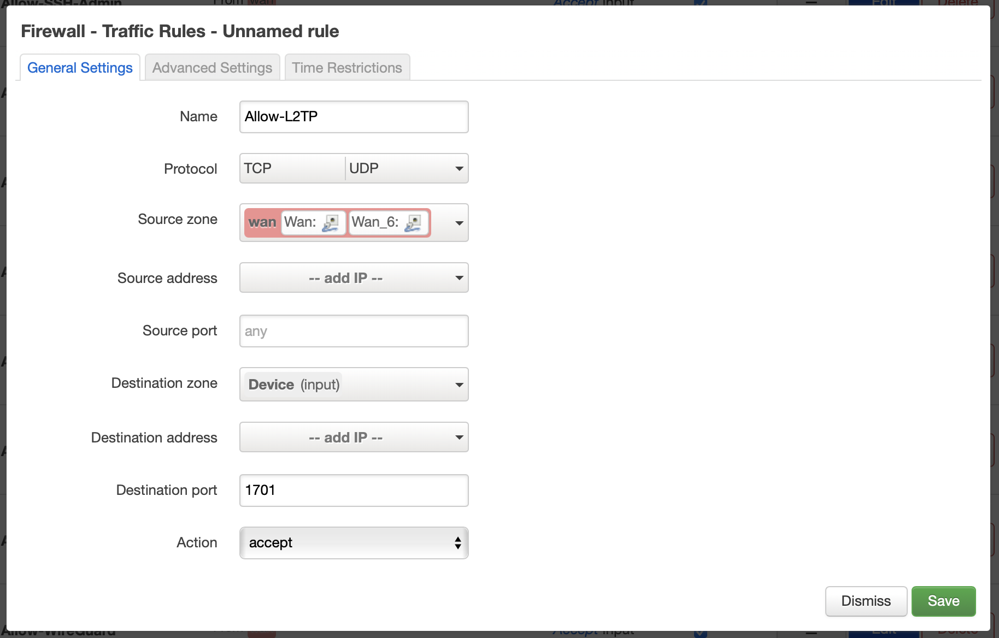

================
VPN Configuraion
================

.. contents:: Table of Contents

Opuntia VPN
-----------

Opuntia supports a wide variety of VPN technologies. The main options for Opuntia are the following Vpn types. 
  
* Wireguard
* OpenVpn
* IPsec 
* IPsec/L2TP

We will detail each option in a section of this chapter of the Opuntia manual. 

Wireguard
---------

WireGuard is a simple and fast modern VPN solution that uses state of the art cyptography. It's designed to be replace IPsec VPN's
while simpler to configure. And it is also more performant than OpenVpn. The offical WireGuard site lists the following as the 
major advantages of WireGuard. 

- Simple & Easy to use
- Cryptographically Sound
- Minimal Attack Surface
- High Performance

WireGuard is also very tolerent of network changes. For example if a client device is connected to a Opuntia system using WireGuard
and the client devices Public Ip Address changes due to roaming to a new network; the WireGuard vpn tunnel can be reestablished in 
just miliseconds. This allows for seemless operation in changing network conditions. 

For these reasons WireGuard is the perfered VPN solution for Opuntia. 

Generate a key pair
###################

WireGuard requires a public and private key pair. And all connectinng devices will need to know the Public key for the 
WireGuard interface. And there must be a unique private key for each WireGuard interface. It's possible to generate these keys 
on other systems and then use those keys on an Opuntia system. But currently there is no built in option to generate a new key 
pair from the Luci Web GUI. This functionality will be added in the future. 

To generate a new WireGuard key pair you will to access the Bash CLI please see the :ref:`Access-SSH` chapter of the manual. Once
you have an active CLI shell, you can run the following commands. 

.. code-block:: bash
   :emphasize-lines: 3

   mkdir -p /etc/wireguard
   cd /etc/wireguard
   wg genkey | tee ./privatekey | wg pubkey > ./publickey

The first two commands create a /etc/wireguard driectory. Only the last line actually creates the public and private key. The 
resulting keys will be Base64 encoded. For the rest of this chapter we will be using the following example keys. ::

  privatekey: 4NM0x6/2ndJktcHTfRXnWS3tzlo95QEgPBsen+swjFw=
  publickey:  2wGMjbn6FU4+QKk7y1s37LuOfotw5moUR2LlFwXqJQ8=

Web GUI
*******

To function, a WireGuard VPN requires a WireGuard Interface and Peer configuraion for each device connected to the VPN. 

To begin creating a new WireGuard interface first navigate to the Network interfaces page.

Main Menu - *Network --> Interfaces*

Then click on the "Add new interface" button. 

Name your new Interface and select protocol *WireGuard VPN*. 

You will then see the WireGuard interface configuraion settings. Start the configuraion by adding the privatekey for this WireGuard 
interface. The privatekey will be only be used in the interface configuraion. To allow 

.. note:: WireGuard will use a default listen port of 51820. If you have multiple WireGuard interfaces you will have to specify different udp ports for each interface. 

While technically not required; we recommend that you set an Ip address on the WireGuard interface. 

Peer Configuraion
*****************

OpenVpn
-------

IPsec
-----

IPsec/L2TP
----------

IPsec/L2TP is a widely deployed VPN technlogy since client support is built into most operating systems. It features the 
strong security of IPsec with the addition of the the L2TP tunneling protocol. This does add complexity to the already 
feature rich IPsec vpn. This allows for a username and password to be asigned each user. This multi-factor VPN 
configuraion is required in some remote security enviorments. 

Currently as of Opuntia version 4.8.17 this configuration has not recieved a Web GUI configuration menu. We will outline
CLI method to configure this VPN type. To successfully configure IPsec/L2TP you will need the following items. 

* Public IP Address
* Pre-Shared Key 
* Username for each user
* Password for each user

Since the default options for IPsec/L2TP is to automatically negotiate most of the options for this type of VPN the 
total configuration is not that complex. There are four main files that need to be edited. 

 The first file that must be edited is /etc/ipsec.secrets. 

.. code-block:: python
  :caption: /etc/ipsec.secrets
  :emphasize-lines: 2
     
  # /etc/ipsec.secrets - strongSwan IPsec secrets file
  203.0.113.1   %any : PSK "3dTamd01m"

This file configures your Public IP address and the Pre-Shared Key. In this example the 203.0.113.1 address is your 
public IP address that the clients will be connecting to. The "%any" allows any Ip Address to connect to this VPN. 
This can be used to limit connecting clients but is generally set to "%any" in most vpn configurations. 

The Pre-Shared Key in this example is a short text string *3dTamd01m* this string can be any valid ASCII string. 

 The second file is the main IPsec configuraion file /etc/ipsec.conf 

 .. code-block:: python
   :caption: /etc/ipsec.conf
   :emphasize-lines: 9-18

   # ipsec.conf - strongSwan IPsec configuration file
   # basic configuration

   config setup
        # strictcrlpolicy=yes
        # uniqueids = no

    # Add connections here.
    conn vpnserver
        type=transport
        authby=secret
        rekey=no
        keyingtries=1
        left=203.0.113.1
        leftprotoport=udp/l2tp
        right=%any
        rightprotoport=udp/%any
        auto=add

Here you see the IPsec Pre-Shared Key configuraion named *vpnserver*. This defines the IPsec parmeters for the connection. 
Notable options specified are *authby=secret*, *left=203.0.113.1*, *right=%any* and both of the right and left protocol 
ports. 

The *authby* setting tells the IPsec subsystem to use the Pre-Shared Key that we set in the /etc/ipsec.secrets file. The 
*left* setting defines the Public IP Address that the system is using and this *right* allows any client to connect. The 
two protocolport options specify that only UDP port 1701 will be encrypted using IPsec. 

This ends the IPsec configuraion that needs to be configured. 

 The next two files deal with the L2TP configuraion. First up is the /etc/xl2tpd/xl2tpd.conf configuraion file.

 .. code-block:: python
   :caption: /etc/xl2tpd/xl2tpd.conf 
   :emphasize-lines: 4,10-11,17

   [global]
   port = 1701
   auth file = /etc/xl2tpd/xl2tp-secrets
   listen-addr = 203.0.113.1
   access control = no
   debug tunnel = no

   [lns default]
   exclusive = yes
   local ip = 192.168.88.1
   ip range = 192.168.88.10-192.168.88.200
   hidden bit = no
   length bit = yes
   require chap = yes
   refuse pap = yes
   name = vpn
   ppp debug = yes
   pppoptfile = /etc/ppp/options.xl2tpd

This is the L2TP server configuraion file. Here you see the Public IP Address referenced in the  global *listen-addr* 
setting. The default lns (L2TP server) specifies the local IP Address that will be assigned to the router and to the
client devices. 

In this example; we have chosen to set the router's IP Address to 192.168.88.1 and we allow clients to use a range
of 192.168.88.10 through 192.168.88.200. If you are accessing other internal networks; you may need to add a 
route to this network from other devices. 

One other setting of note is the *ppp debug = yes* option. This will cause verbose system logs to be generated 
when clients connect to the vpn service.

 The final configuration file defines the users and passwords that the clients need to provide to access the VPN.  

 .. code-block:: python
   :caption: /etc/ppp/chap-secrets 
   :emphasize-lines: 3-4

   # Secrets for authentication using CHAP
   # client       server         secret               IP addresses
   alice         vpn            47roses            *
   bob           vpn            D3adB33f           *

This file is the standard chap-secrets format. Here we have two users setup; alice and bob. We see the server setting is 
*vnp* which is the name of the default lns set in our example xl2tpd.conf file from above. We also see the two 
passwords that these users have chosen. This "*" setting allows the client to get any IP address from the pool 
that we have defined. 

Firewall configuraion
#####################

By default Opuntia needs to be configured to allow incoming L2TP connections in the *wan* firewall zone. If see the 
firewall chapter for more general information. 

The rule we need to add is an accept rule for the *Wan* input zone that allows TCP and UDP port 1701 traffic.

To navigate to the Firewall configuraion page. 

Main Menu - *Network --> Firewall --> Traffic Rules*

Once that rule is installed you will see this from the firewall ruleset summary. 

.. image:: ../manual-images/Firewall-Rules-L2TP-Applied.png
  :width: 600
  :alt: L2TP Firewall ruleset

Client Setup
############

MacOS Big Sur
*************

MacOS supports IPsec/L2TP clients natively. In this section we will detail the configuraion process when setting up a MacOS 
client to connect to our example IPsec/L2TP vpn from above.

.. image:: ../manual-images/VPN-Client/VPN-L2TP-Macos-Step1.png
  :width: 400
  :alt: MacOS Big Sur Step1

The first step is to add a new interface in the *System Preferences*-->*Network*. You can create a new Interface by clicking 
the + in the bottom left side of the interface menu. Set the "Interface Type" to *VPN* and the "VPN Type" to 
*L2TP over IPsec*. The "Service Name" can be set to your perfered name for the VPN. In our example we will set it to
*L2TP-VPN*. 

The next step is to configure the basic "Server Address" and "Account Name" for the VPN. The "Server Address" will be the 
public IPv4 address that we set above; or in this example *203.0.113.1*. The "Account Name" will be *alice*.

The next two configuraion items can be set by pressing the "Authentication Settings..." button.

 
In the "Authentication Settings" dialog box, you will need to set the password for the user. In this example the password 
for *alice* is *47roses* and is entered into the "Password" field in the "User Authentication" section. 

Next; set the *Pre-Shared Key* in the "Shared Secret" field in the "Machine Authentication" section. In our example 
this would be *3dTamd01m*. This concludes the minimum configuraion settings for a IPsec/L2TP VPN. 

**MacOS Big Sur Optional Settings**

MacOS IPsec/L2TP has two common configuraion options descibed below.  

By default MacOS does not route all traffic through the IPsec/L2TP Vpn. This is a common requested configuraion. Access the 
advanced vpn configuration option. Then under the *Options* tab select "Send all traffic over VPN connection". 

When routing all traffic over the VPN it is also necessary to define your DNS servers. Access the advanced vpn 
configuration option. Then under the *DNS* tab add a new DNS server by clicking the "+" button on the bottom left side of 
the dialog box. In this example we set the Google IPv4 public DNS servers.  

 

