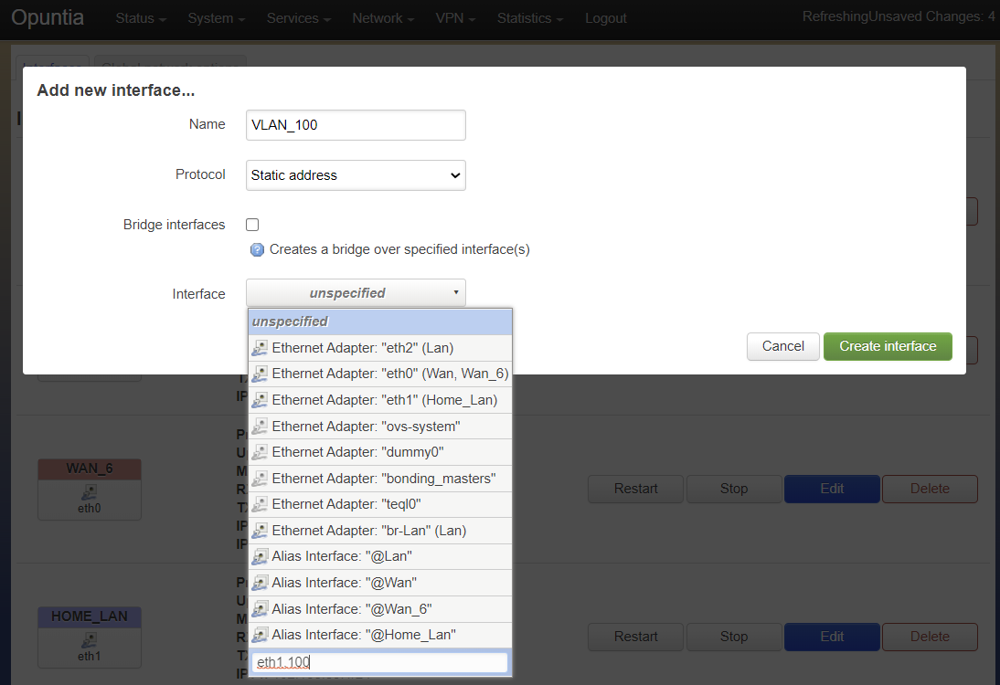

=====================================
Wired Ethernet Interface Configuraion
=====================================

.. contents:: Table of Contents

Interfaces in Opuntia
---------------------

A familiar concept in computer networking is that of the "Interface". An "Interface" is a software construct that allows 
computer systems to interact with networks. An interface can represent a physical device like an Ethernet port. It can also 
represent virtual devices like a Loopback device. 

Opuntia extends this concept slightly. Opuntia is based on a Linux operating system and the base Linux system can have many 
different network Interfaces. An Opuntia interface can be mapped to a Linux Interface. And The Opuntia Interface can also 
be a group of bridged Linux Interfaces. By bridging multiple interfaces together they all share the same network IP / IPv6
address space. And any host connected to any of these interfaces can communicate directly.   

For example a common configuration is to have a *Lan* and *Wan* network interface. The *Wan* interface is mapped to an 
Linux interface that is connected to an upstream Internet provider. The *Lan* interface is often a brige of all of the other
Ethernet interfaces on the router. This replicates a common CPE (Customer premises equipment) configuration where one
interface is used to connect to an Internet provider and all other interfaces in the system share a network. 

This relationship between an interface in Opuntia and the base Linux networking interface is a key concept that is also
needed to understand how to configure VLAN tags on Ethernet devices. This will be covered in detail in the VLAN section. 
But as a brief introduction it is the mapping of the Opuntia interface to the Linux networking interface that controls
if traffic leaving the system will be VLAN tagged. 

So Opuntia networking interfaces are either a 1:1, 1:many or even a many:1 mapping with respect to the Linux networking 
interfaces. The Opuntia interfaces have flexible naming making it easy to understand the purpose of an interface; for example
name of *Wan* vs a Linux device name of *enp97s0f0*. They are also used to define membership of a firewall zone. 

In Opuntia each interface has an associated network protocol. Going back to the common example of CPE device. 
The *Wan* interface normally configured with protocol "DHCP Client". This configuration results in the system making an IPv4 
DHCP request on the physical interface connected to the ISP. If IPv6 DHCP is required it's common to have a *Wan_6* interface also 
configured. This Opuntia interface shares the same physical interface with the *Wan* interface. But it has a different
network protocol configuration in this case "DHCPv6 client". The *Lan* interface would have a "Static address" configured.
This static address will often be a private `RFC 1918 address <https://tools.ietf.org/html/rfc1918>`_. 

Below is the Network Interface page from a router configured in this scenario. You will see a pair of *Wan* and *Wan_6* 
interfaces. These interfaces have protocol "DHCP" and "DHCPv6" configured. In this we are getting ip address 
192.168.79.14/24 on the *Wan* interface and 2605:6000:62e0:400::1fa/128 on the *Wan_6* interface. Both the *Wan* and *Wan_6* 
interface are sharing the same Linux device in this case *eth0*.  The *Lan* interface is configured with a static IPv4 address
of 10.10.199.1/24 and the IPv6 subsystem has assigned a network range of 2605:6000:62e0:410::1/62 to this interface. 
The color code of the devices tell you which firewall zone applies to the interface. 

.. image:: ../manual-images/Network-Interfaces-Wan-Lan-example.png
  :width: 750
  :alt: Screenshot of the Interfaces page in the Wan/Lan example 

To demonstrate what is happening at the Linux level here is the configuration in the base operating system. The Linux *eth0*
interface has both the DHCP assigned IPv4 address and the DHCPv6 assigned IPv6 address bound.   

.. image:: ../manual-images/Linux-ifconfig-Wan-Lan-example.png
  :width: 700
  :alt: Screenshot showing how both the DHCP/DHCPv6 address is on a single Linux network Interface.

Understanding how Opuntia is interacting with the Linux networking stack is important if you plan to use custom iptables 
firewall rules, monitoring and interacting in the CLI. The Linux networking stack is unaware of Opuntia device names. 
So attempts to use the Opuntia device names from the CLI will fail.  

Vlan Configuraion
-----------------

To configure VLAN interfaces in Opuntia is a simple process but slightly non-intuitive. In the above section we talked about how
Opuntia interces are not necessarily the same as the Linux Interfaces. The Linux interface is what controlls if a device adds a 
VLAN tag to outgoing Ethernet frames. This is done by simply setting the Linux interface name ending with .#vlan-id#. So for
example; if you wanted to configure the physical interface eth1 to use VLAN ID 100 you would create a interface named eth0.100. 
To do this you will have to create a new interface then set a custom device name. 

The following screenshots show this operation. First you will create a new Interface. In this example we are using protocol
static. The physical interface will start as *unspecificed* we select the dropdown box and type a custom Interface name into
the box. In this case since we want the new Interface to be VLAN ID 100 on the physical eth1 interface we type **eth1.100**. 

Once we have input the custom interface name, hit enter and the Interface dropdown box will fill in the name correctly.

This is all that is required to configure a VLAN tagged Opuntia Interface. All traffic transmited on this interface will leave 
the system with VLAN tag 100 set. All Ethernet frames recieved on eth1 with VLAN tag 100 will be recieved on this interface. 

This is what Opuntia will show when the interface is finished being configured. Note the interface name listed as **eth1.100**. 

QinQ
####

Opuntia also supports IEEE 802.1ad also known as provider bridging or QinQ VLAN tagging. This allows for *Stacking* VLAN taggs. 
The configuration is exactly the same as with normal VLAN configuration but you add an extra VLAN tag. In the following example
we are configuring a QinQ interface that has a provider service tag (*S-TAG*) of 100 and a customer tag (*C-TAG*) of 20. Follow 
directions to configure VLAN interfaces and input "eth1.100.20" as the device name. 

Here is what Opuntia will show after this is configured. Note the device name listed as **eth1.100.20**. 

Here is what this looks like at the Linux interface level. 

Protocol Configuraion
---------------------

Opuntia supports several different interface protocols. This protocol configuration setting configures the main operating
mode of the interface. Below are the most commonly used protocol types. 

* Static addresses
* DHCP client
* DHCPv6 client
* Unmanaged
* WireGuard VPN
* Link Aggregation (IEEE 802.3ad)
* PPPoE

We will cover each of these protocol types in detail. But there are other types that are supported but we are not documenting 
at this time due to lack of real world useage. If you believe that you are required to use one of these protocols and you are 
having difficulty plese contact ImageStream support at *support@imagestream.com*.  

To change the protocol setting of an interface first navigate the the Interface page in the Web GUI. 

Main Menu - *Network --> Interfaces*

There you will see a listing of all of the interfaces currently configured in the system. Below is an example of we are 
showing the interfaces page from the *Wan and Lan* example we used in talking about Opuntia interfaces. 

.. image:: ../manual-images/Network-Interfaces-Wan-Lan-example.png
  :width: 750
  :alt: Screenshot of the Interfaces page in the Wan/Lan example 

As you can see we have three defined interfaces; Wan, Wan_6 and Lan. This example has protocol DHCP configured on the *Wan* 
interface, DHCPv6 on the *Wan_6* interface and Static address protocol on the *Lan* interface. 

To change an interface to a different protocol click the "Edit" button for that interface. Then select the drop down box 
labled "Protocol". 

You can select your new protocol and you will have to *Save & Apply* the change in the Interfaces page before you will be 
able to configure settings for the newly selected protocol. 

Static addresses
################

The "Static Protocol" is allows for setting IPv4/IPv6 addresses and address ranges manually on an interface. This one of the 
most common configuration scenarios. This protocol is frequently used with *internal* RFC 1918 addresses and for upstream Internet 
connections. The "Static Protocol" also allows the configuration of DHCP/DHCPv6 servers. So this protocol type is almost 
universally used on at least one interface in any deployment. 

Web GUI
*******

The interface configuration is accessed by navigating to the Network interfaces page. 

Main Menu - *Network --> Interfaces*

Once you have navigated to the interfaces page, you can click on the "Edit" button on the interface to see the "General Settings" 
tab.   

In this screenshot you see the "General Settings" tab. This tab allows for the setting of static IPv4 and IPv6 addresses.
 

- General Settings (IPv4/IPv6 address, netmask and Custom DNS servers)
- Advanced Settings (Built-in IPv6, MAC address override and MTU override)
- Physical Settings (Bridging configuration and Interface Selection)
- Firewall Settings (Firewall zone assigned to the interface)
- DHCP Server (DHCP Settings and IPv6 specific configuration)

**IPv4**

IPv4 addresses are the most commonly configured static addresses.  When setting IPv4 address you are given the option of inputing 
the address and netmask separately or to use the CIDR list notation. ImageStream recommends using CIDR syntax as it's more human 
readable and less likely to result is the incorrect configuration of address ranges. 

To ensure that you are using CIDR List notation. Click the small check box at the end of the IPv4 address box. 

.. image:: ../manual-images/Network-Interfaces-Static-Proto-IPv4-CIDR.png
  :width: 700
  :alt: Screenshot showing the CIDR check box
  
.. note:: When operting is CIDR notation it's import to make sure that you click the "+" button after typing in the address or it will not be saved. 

This example shows an address that has **NOT** been saved correctly.

.. image:: ../manual-images/Network-Interfaces-Static-Proto-CIDR-not-saved.png
  :width: 700

And this example shows the address is correctly saved. You will see a new text box below all saved addresses. 

.. image:: ../manual-images/Network-Interfaces-Static-Proto-CIDR-saved.png
  :width: 700

Other important IPv4 settings include "IPv4 gateway". It's important to note that this should only be set on a single interface
since this will set the global default IPv4 route for the system.   

**IPv6 with Prefix Delegation**

.. important:: With IPv6 deployments the majority of configurations will be using ISP provided network space. If your deployment uses provider delegated network Prefixes you **MUST** use the built IPv6 management options described below and DHCP server **MUST** be enabled on this interface. 

The Opuntia operating system includes an automatic system to manage IPv6 when you recieve a IPv6 Prefix delegation from an upstream
provider. This automatic system will ensure that the system is providing downstream clients with the correct IPv6 addresses and 
manages any changes in routing that may be required. IPv6 Prefix delegation is by far the most common configuration scenario if you 
are connecting to the IPv6 Internet. This is fundementatly a dynamic proccess that makes it impossible to set a static IPv6 address.

But the built-in IPv6 management system does allow for several tunable values that allows the system administrator to control the
deployment of IPv6 networks and addresses. In order of importance these options are; IPv6 assignment length, IPv6 suffix and IPv6
assignment hint. Each of these options will be discussed in detail in this section. It is important understand that in most 
common configurations the only settting that you are likely to configure is IPv6 assignment length. The other two values are likely
to remain unconfigured or in the default state. 

The "IPv6 assignment length" allows the administrator to chose the desired IPv4 prefix length for the interface. This setting is 
also used to signal to the Opuntia operating system to enable to built-in IPv6 management on this interface. Selecting any value
will disable the normal static IPv6 configuration options for setting a static IPv6 address, IPv6 gateway and IPv6 routed prefix.

IPv6 assignment length is typically set to 64 bits. A IPv6 Prefix length of 64 bits allows for the standard IPv6 address 
auto-configuration for most client devices (SLAAC and DHCPv6). To function correctly you must recieve a IPv6 Prefix delegation from 
an upstream provider.

For example if the Opuntia system recieved a IPv6 prefix delegation of 2605:540:1::/60 and we set the "IPv6 assignment length" to 
64 bits; Opuntia will configure one of the 16 /64 network ranges in the 2605:540:1::/60 delegation on this interface. If the 
upstream provider changes the IPv6 prefix delegation those changes will be automatically applied to all downstream devices. 

.. note:: Most client operating sytems install IPv6 routes using the link local address of the router. So a human readable address on a interface is purely a management feature.

The "IPv6 suffix" sets the IPv6 Interface ID. This is the last 64bits of a IPv6 address. This allows the administrator to control 
the last part of an IPv6 address that is assigned. Given our example of receiving a IPv6 prefix of 2605:540:1::/64 if we were 
set the the "IPv6 suffix" to "::100:1"; the expected IPv6 address assigned to the interface would be 2605:540:1::100:1/64. This 
setting does have a default value of "::1" so in many cases you will not need to make adjustments to this setting if you want your
routers IPv6 to in ::1. 

Setting the IPv6 suffix setting is useful for network troubleshooting. It allows you to set the human readable IPv6 address that 
the router will use when being probed with standard troubleshooting tools like traceroute and ping.  

.. important:: If a "IPv6 assignment hint" is outside of the IPv6 prefix ranges that are available this setting will have no effect.

If we wanted to control which /64 IPv6 prefix will be selected we can use the second setting "IPv6 assignment hint". This is an 
optional value, the default is not set. If this option is in the default state, the system will try to effecently allocate IPv6 
networks. If control of the assigned network is required; the value is a hex number that matches sub-Prefix ID. So in 
this example if we want to assign 2605:540:1:2::/64 we could set the hint value to "2". Or if it was required to assign 
2605:540:1:f::/64 we would set the value to "f". 

Given the dynamic nature of IPv6 prefix delegation it is often not required to control the specific network. Also it's important to
remember that this is a "hint" that requires the expected network address to be included in your IPv6 prefix delegation. If your
provider adjustes the assigned prefix delegation it is quite possible that your "hint" will no longer be able to map to a valid 
network range. That would result this setting having no effect. For this reason we suggest not using this feature if you are 
receiving a Prefix Delegation. But it is useful in a few deployment scenarios so it's usage is detailed here. 

**DHCP/DHCPv6 settings - Static protocol**

.. note:: It is a required that you use DHCP server settings on the interface for downstream devices to recieve IPv6 prefix delegation. 

Client devices normally are not statically assigned IPv6 addresses. If you are using the recommended Opuntia built-in IPv6 
management to delegate IPv6 Prefixes you must configure DHCP/DHCPv6 server on this interface. This section will contain only a 
brief list of commands and settings needed to ensure that client devices will function. For a full description of the DHCP / DHCPv6
server Interface settings and Global DHCP settings please look at the DHCP Server chapter linked below.

:doc:`dhcp-server`

.. image:: ../manual-images/Network-Interfaces-Static-DHCP-unconfig.png
  :width: 700
  :alt: Screenshot of the DHCP tab before being configured

To begin, Edit the interface and click to the "DHCP Server" tab. You will see a large button labled "Setup DHCP Server".

.. image:: ../manual-images/Network-Interfaces-Static-DHCP-Gen.png
  :width: 700
  :alt: Screenshot of the DHCP General Setup tab

This tab shows the basic DHCP server settings for the interface. 

- Ignore interface
- Start
- Limit
- Lease time

The "Ignore interface" checkbox will disable the IPv4 DHCP server on this interface. If selected this will automatically hide the 
"advanced settings" tab. This can be a useful configuration option if you are manually assiging IPv4 addresses but you want to use
the built-in IPv6 subsystem. 

The "Start" configuration setting specifies where in the IPv4 network range to begin allocating DHCP client ip addresses. For 
example if you have a static network of 192.168.85.0/24 allocated to the interface and you have the "Start" setting set to 100; the
lowest ip address that can be allocated is 192.168.85.100. This is a required setting if DHCP server is enabled. 

The "Limit" setting works with the start value to limit how many addresses can be allocated and thereby defining the DHCP addresses
that can be allocated. In our example of starting our DHCP pool at 192.168.85.100 if we use the default value of 150 ro the "Limit" 
setting that results in the system allocating Ip addresses from 192.168.85.100 to 192.168.85.250. Or otherwise limiting the 
allocation to 150 addresses above the "Start" setting. This is a required setting if DHCP server is enabled. 

The "Lease time" setting defines the length of time that the DHCP Lease is valid. This is a required setting if DHCP server is 
enabled.  

To configure DHCPv6 settings click the "IPv6 Settings" tab. 

.. image:: ../manual-images/Network-Interfaces-Static-DHCPv6.png
  :width: 700
  :alt: Screenshot of the DHCPv6 settings

On this tab we see the DHCPv6 settings. The most commonly used settings are as follows.  

- Router Advertisement-Service
- DHCPv6-Service
- DHCPv6-Mode
- Announced DNS servers

The "Router Advertisement-Service" enables the Opuntia system to send IPv6 router Advertisement packets on this interface. This 
allows client devices to learn that the Opuntia system is acting as a router for this network. It also serves as the primary 
enabler for the usage of SLAAC (Stateless address autoconfiguration) to automatically configure IPv6 networks. The recommended 
value is "Server mode". 

The "DHCPv6-Service" is the setting that actually starts DHCPv6 on the Interface. The recommended value is "Server mode".

The "DHCPv6-Mode" controls the operating mode of the DHCPv6 Server. This settting will be explained in more detail in the DHCP 
Server chapter. The recommended value is "Stateless + Stateful". 

The last most commonly configured IPv6 DHCPv6 is "Announced DNS servers". This value is very similar to setting the DNS server 
option for IPv4. This allows the DHCPv6 clients to learn a list of DNS servers. This is an optional setting since you may learn 
DNS servers from IPv4 DHCP or other methods. 

One interesting thing about the "Announced DNS servers" setting is that you can announce IPv4 or IPv6 DNS servers addresses using 
this configuration value. Depending on the enviorment, it may be valid to only have IPv4 DNS servers specified in the IPv6 DHCPv6 
service. 

.. image:: ../manual-images/Network-Interfaces-Static-DHCPv6-dns.png
  :width: 700
  :alt: Screenshot showing IPv4 and IPv6 DNS servers being Announced using DHCPv6. 
 

**Static IPv6**

There are several deployment scenarios where you will not recieve an IPv6 prefix delegation. Typically this is when you are learning
IPv6 routes over a dynamic routing protocol such as BGP or Ospfv3. In these cases you are required to set a IPv6 manually on 
interfaces. To get started, you first must be sure that the "IPv6 assignment length" setting is set to disabled.

By disabling the "IPv6 assignment length" you will now see these configuration options. 

- IPv6 address
- IPv6 gateway
- IPv6 routed Prefix
- IPv6 suffix

Given that IPv6 fundementatly supports multiple addresses per interface; CIDR List notation is the only option for manually setting 
IPv6 addresses. Be sure to click the small check box at the end of the IPv6 address box. Below is an example of adding multiple 
IPv6 addresses to an interface. 

.. image:: ../manual-images/Network-Interfaces-Static-Proto-IPv6-example.png
  :width: 700
  :alt: Screenshot of adding two IPv6 Address manually

The "IPv6 routed Prefix" is used with the built-in IPv6 management system. This allows the system administrator to specify a 
static IPv6 Prefix that is distrubted to clients devices using DHCPv6. DHCPv6 **MUST** enabled for this setting to be effective. 
Since this prefix range is specified manually by the administrator; the administrator must ensure that this IPv6 Prefix range is 
routed to the Opuntia system. This can be done using dynamic routing protocols like BGP, Ospfv3 or static routes. 

The "IPv6 suffix" sets the IPv6 Interface ID. This is the last 64bits of a IPv6 address. This allows the administrator to control 
the last part of an IPv6 address that is assigned. This setting only takes effect if you have also specified a "IPv6 routed Prefix". 
This setting has a default value of "::1". 

CLI
***

When accesing Network interface configuration is stored in the file at location */etc/config/network*. You can edit this file with
vi or nano. After making changes to the configuration files you need to run the following command from the system shell. ::

  reload_config

This will force the system to reload the running configuration from the saved config files. Since the static protocol is often used
with DHCP/DHCPv6 server settings we will also cover that configuration in this section. The DHCP server settings are located at 
*/etc/config/dhcp*. 

.. important:: When directly configuring the any settings in the configuration files it is possible to input invalid settings. Take care to enter correct values.

**Interface IPv4 settings** 

Below we will cover a few common IPv4 configuration scenarios and what the configuration file format will look like in those 
deployments.

This example sets a static IPv4 address on interface named "Home_Lan" and a DHCP server on the interface with a ip-pool range of 
192.168.85.10 - 192.168.85.250 with a leasetime. The two configuration files that need to be modified are /etc/config/network for 
the interface configuration. And /etc/config/dhcp for the DHCP server configuration. 

.. code-block:: python
  :caption: /etc/config/network
  :emphasize-lines: 4
     
  config interface 'Home_Lan'
        option ifname 'eth1'
        option proto 'static'
        list ipaddr '192.168.85.1/24'
        list dns '192.168.85.10'

.. code-block:: python
  :caption: /etc/config/dhcp
  :emphasize-lines: 3-5
     
  config dhcp 'Home_Lan'
        option interface 'Home_Lan'
        option start '10'
        option leasetime '3h'
        option limit '250'
        
**IPv4 CLI Options**

Here is a list of common configuration options for IPv4 interfaces and value descriptions. 

.. table:: /etc/config/network

   +---------------+----------------------+----------+--------------------------------------------------+
   | Name          | Type                 | Required | Description of the command                       |
   +===============+======================+==========+==================================================+
   | ifname        | Interface Name       | Yes      | Physical Interface Name                          |
   +---------------+----------------------+----------+--------------------------------------------------+
   | proto         | Protocol Type        | Yes      | Protocol                                         | 
   +---------------+----------------------+----------+--------------------------------------------------+
   | ipaddr        | ip address           | Yes      | Ip address CIDR list                             |
   +---------------+----------------------+----------+--------------------------------------------------+
   | netmask       | netmask              | No       | IPv4 Subnet mask                                 |
   +---------------+----------------------+----------+--------------------------------------------------+
   | gateway       | ip address           | No       | Default IPv4 gateway                             | 
   +---------------+----------------------+----------+--------------------------------------------------+
   | broadcast     | ip address           | No       | Broadcast IPv4 address                           |
   +---------------+----------------------+----------+--------------------------------------------------+ 
   | dns           | list of ip addresses | No       | Dns Server List                                  | 
   +---------------+----------------------+----------+--------------------------------------------------+
   | metric        | integer              | No       | Route metric for this interface                  |
   +---------------+----------------------+----------+--------------------------------------------------+

Here is a list of common IPv4 DHCP Configuraion options.

.. table:: /etc/config/dhcp

   +---------------+----------------------+----------+-----------------------------------------------------+
   | Name          | Type                 | Required | Description of the command                          |
   +===============+======================+==========+=====================================================+
   | interface     | interface name       | Yes      | Opuntia Interface name                              |
   +---------------+----------------------+----------+-----------------------------------------------------+
   | ignore        | Int                  | No       | Ignore IPv4 DHCP server on this interface           |
   +---------------+----------------------+----------+-----------------------------------------------------+
   | start         | Int                  | No       | IPv4 dhcp pool start address ofset                  |
   +---------------+----------------------+----------+-----------------------------------------------------+
   | limit         | Int                  | No       | Number of addresses in the IPv4 dhcp pool           |
   +---------------+----------------------+----------+-----------------------------------------------------+
   | leasetime     | Time                 | No       | Lifetime of the dhcp lease  (hours or minutes)      |
   +---------------+----------------------+----------+-----------------------------------------------------+
   | dns           | list of DNS addresses| No       | Lists of dns servers to advertise to dhcp clients   |
   +---------------+----------------------+----------+-----------------------------------------------------+

**Interface IPv6 settings**

Below we will cover a few common IPv6 configuration scenarios and what the configuration file format will look like in those 
deployments.

This example shows you a typical dual stack IPv4 / IPv6 where you are receiving a IPv6 Prefix Delegation. This example shows that
you are only required to configure the ip6assign length. This will then use the built-in IPv6 management to determine the correct
IPv6 Subnet to assign to the interface. Since the IPv6 suffix(ip6ifaceid) has a default value of "::1" the typical configuration 
only has the 'ip6assign' option configured. 

We are also configuring DHCPv6 to allocate addresses from the assigned IPv6 Prefix. This is configuration example for working in a 
dual-stack enviorment.

This example shows the simplest IPv6 configuraion. This requests a /64 IPv6 netblock to be assigned to the interface. This will cause
the system try to obtain a valid public IPv6 network to assign to the interface. This address space is allocated from the assigned IPv6
prefix delegation that the system obtained via DHCPv6. If there is insufficient IPv6 address space, the system will not assign a /64. 

.. code-block:: python
  :caption: /etc/config/network
  :emphasize-lines: 6
     
  config interface 'Home_Lan'
        option ifname 'eth1'
        option proto 'static'
        list ipaddr '192.168.85.1/24'
        list dns '192.168.85.10'
        option ip6assign '64'

This DHCP/DHCPv6 configuraion shows how to set the Opuntia system as a DHCPv6 server. And allows for the system to do prefix delegation 
to downstream devices. This is typically combinded with the simple Dual Stack interface configuraion above.  

.. code-block:: python
  :caption: /etc/config/dhcp
  :emphasize-lines: 3-5
     
  config dhcp 'Home_Lan'
        option interface 'Home_Lan'
        option ra_management '1'
        option ra 'server'
        option dhcpv6 'server'
        option start '10'
        option leasetime '3h'
        option limit '250'

This example shows two static IPv6 addresses assigned to the Home_Lan Interface. 

.. code-block:: python
  :caption: /etc/config/network
  :emphasize-lines: 4-5

  config interface 'Home_Lan'
        option ifname 'eth1'
        option proto 'static'
        list ip6addr '2506:dead:beef:540::1/64'
        list ip6addr '2007:86:e0f1:480::5/128'
        option ip6prefix '2001:10:96:e010::/64'

This example shows a configuration of a pure IPv6 network. This uses the built-in IPv6 management to assign the /64 netblock.  

.. code-block:: python
  :caption: /etc/config/network
  :emphasize-lines: 4

  config interface 'Home_Lan'
        option ifname 'eth1'
        option proto 'static'
        option ip6assign '64'

**IPv6 CLI Options**

To access the Opuntia systems CLI interface please see the :ref:`Access-SSH` chapter of the manual. 

Common configuraion options are listed in the table below. 

.. table:: /etc/config/network

   +---------------+----------------------+----------+-----------------------------------------------------+
   | Name          | Type                 | Required | Description of the command                          |
   +===============+======================+==========+=====================================================+
   | ifname        | Interface Name       | Yes      | Physical Interface Name                             |
   +---------------+----------------------+----------+-----------------------------------------------------+
   | proto         | Protocol Type        | Yes      | Protocol                                            | 
   +---------------+----------------------+----------+-----------------------------------------------------+
   | ip6addr       | ipv6 address         | Yes / No*| IPv6 Address (not required if an IPv4 ipaddr is set)|
   +---------------+----------------------+----------+-----------------------------------------------------+
   | ip6ifaceid    | ipv6 suffix          | No       | IPv6 Interface ID ( fixed value, Random, eui64)     |
   +---------------+----------------------+----------+-----------------------------------------------------+
   | ip6gw         | ipv6 address         | No       | IPv6 Default Gateway                                |
   +---------------+----------------------+----------+-----------------------------------------------------+
   | ip6assign     | prefix length        | No       | Delegate a prefix of this length                    |
   +---------------+----------------------+----------+-----------------------------------------------------+
   | ip6hint       | prefix hint          | No       | Prefix hint in Hex format                           |
   +---------------+----------------------+----------+-----------------------------------------------------+
   | ip6class      | ipv6 prefix          | No       |                                                     |
   +---------------+----------------------+----------+-----------------------------------------------------+
   | ip6prefix     | ipv6 prefix          | No       | IPv6 prefix for distribution to clients devices     |
   +---------------+----------------------+----------+-----------------------------------------------------+

.. table:: /etc/config/dhcpv6

   +---------------+----------------------+----------+-----------------------------------------------------+
   | Name          | Type                 | Required | Description of the command                          |
   +===============+======================+==========+=====================================================+
   | interface     | interface name       | Yes      | Opuntia Interface name                              |
   +---------------+----------------------+----------+-----------------------------------------------------+
   | leasetime     | Time                 | No       | Lifetime of the dhcp lease  (hours or minutes)      |
   +---------------+----------------------+----------+-----------------------------------------------------+
   | dns           | list of DNS addresses| No       | Lists of dns servers to advertise to dhcp clients   |
   +---------------+----------------------+----------+-----------------------------------------------------+
   | dhcpv6        | server mode          | No       | DHCPv6 server ( server, relay or hybrid )           |
   +---------------+----------------------+----------+-----------------------------------------------------+
   | ra            | server mode          | No       | Router Advertisement mode (server, relay or hybrid) |
   +---------------+----------------------+----------+-----------------------------------------------------+
   | ra_management | Int                  | No       | DHCPv6 mode ( 1: Stateless + Stateful )             |
   +---------------+----------------------+----------+-----------------------------------------------------+

DHCP Client
###########

The "DHCP client" protocol configures an interface to request a IPv4 using the DHCP protocol. When connecting as a client device
to a network this is often the desired configuration since it allows automatic configuration of the IPv4 address and DNS settings.

.. note:: Dual Stack IPv4 and IPv6 requires separate Opuntia Interfaces. By default Opuntia has a *Wan* Interface for DHCP and a *Wan_6* Interface for DHCPv6 the physical interface needs to be set to the upstream interface.

For more information on Dual Stack configurations see the :ref:`Wired-DHCPv6-Client` section. 

Web GUI
*******

The interface configuration is accessed by navigating to the Network interfaces page.

Main Menu - *Network --> Interfaces*

Once you have navigated to the interfaces page, you can click on the "Edit" button on the interface to see the "General Settings" 
tab.   

This screenshot shows you the basic DHCP interface configuration. Since protocol "DHCP client" requests the network configuration 
from a DHCP server, there is little user configuration required. The most important user configuration setting is likely to be the 
choice of Firewall zone in the Firewall settings tab. Since "DHCP client" is often configured on interfaces connected to upstream 
Internet access the default *wan* firewall zone is likely the correct setting. 

The other Tabs have the following different types of configuration options. 

- Advanced Settings (MAC address override and MTU override)
- Physical Settings (Bridging configuration and Interface Selection)
- Firewall Settings (Firewall zone assigned to the interface)

CLI
***

The "DHCP client" protocol is has few default configuration options. So the CLI configuration is very simple. Just connect to 
the Opuntia system via ssh. To access the Opuntia systems CLI interface please see the :ref:`Access-SSH` chapter of the manual.

Below is a typical configuration for the "DHCP client" protocol on a *Wan* interface. 

.. code-block:: python
  :caption: /etc/config/network
  
  config interface 'Wan'
        option ifname 'eth0'
        option proto 'dhcp'

Since this such a simple configuration. Below is more complex configuration that overrides the hostname that the 
system will report to the upstream DHCP server. 

.. code-block:: python
  :caption: /etc/config/network
  
  config interface 'Wan'
        option ifname 'eth0'
        option proto 'dhcp'
        option hostname 'Opuntia-Test'

**CLI Configuraion Options**

Common configuraion options are listed in the table below.

.. table:: /etc/config/network

   +---------------+----------------------+----------+--------------------------------------------------+
   | Name          | Type                 | Required | Description of the command                       |
   +===============+======================+==========+==================================================+
   | ifname        | Interface Name       | Yes      | Physical Interface Name                          |
   +---------------+----------------------+----------+--------------------------------------------------+
   | proto         | Protocol Type        | Yes      | Protocol 'dhcp'                                  | 
   +---------------+----------------------+----------+--------------------------------------------------+
   | hostname      | hostname             | No       | Hostname override (Defaults to current hostname) |
   +---------------+----------------------+----------+--------------------------------------------------+

.. _Wired-DHCPv6-Client: 

DHCPv6 Client
#############

The "DHCPv6 client" protocol configures an interface to request IPv6 prefix delegation from a DHCPv6 server. This is the IPv6 
equivlent "DHCP client" protocol with a few key differences. One of the major differences is that Opuntia will automatically 
configure IPv6 addresses using Stateless address autoconfiguration (SLAAC), stateless DHCPv6, stateful DHCPv6 or DHCPv6-PD if any
of these options are available. Since a IPv6 host addresses is going to be configured automatically on interfaces, the role of 
DHCPv6 is often to recieve a IPv6 Prefix Delegation using DHCPv6-PD. 

Dual Stack
**********

Dual Stack operations with concurent IPv4 and IPv6 addresses assigned to the same physical networks is a very common 
configuration. Opuntia allows this type of configuration but since you can not run multiple protocols on a single Opuntia 
interface; Opuntia by default includes multiple Interfaces for upstream DHCP (*Wan*) and DHCPv6 (*Wan_6*). These interfaces 
allow the operator to configure protocol DHCP and DHCPv6 on the same physical Linux Interface. Care must be taken to be sure
the same physical interface is referenced in both the *Wan* and *Wan_6* Opuntia Interfaces.  

Web GUI
*******

The interface configuration is accessed by navigating to the Network interfaces page.

Main Menu - *Network --> Interfaces*

Once you have navigated to the interfaces page, you can click on the "Edit" button on the interface to see the "General Settings" 
tab.   

The DHCPv6 protocol has two main configuration options. The "Request IPv6 address" mode and the "Request IPv6 Prefix length". 

The "Request IPv6 address" mode sets if we are attempting to request an IPv6 address on the interface. The default option is *try* 
which as the name implies tries to allocate an IPv6 address. This recommended setting. 

The "Request IPv6 Prefix length" option specifies the length of requested IPv6 prefix delegation from the upstream router. The 
default value is *auto* and available options are *auto, no, 0-64*. The *auto* setting will accept the prefix length that the 
upstream router provides.

.. important:: The *auto* setting will not request automatically request enough IPv6 prefix space for your configuration. 

If you need more IPv6 space than your provider is allocating to the system by default; you can then specify the IPv6 Prefix length 
mannually. Normally providers will not allow prefix delegation requests larger than a /56. Adjust the requested IPv6 Prefix length 
as needed. 

The other Tabs have the following different types of configuration options. 

- Advanced Settings (MAC address override and MTU override)
- Physical Settings (Bridging configuration and Interface Selection)
- Firewall Settings (Firewall zone assigned to the interface)

CLI
***

To access the Opuntia systems CLI interface please see the :ref:`Access-SSH` chapter of the manual. 

The DHCPv6 protocol has few required options for a standard configuraion. Below is a common example configuraion. 

.. code-block:: python
  :caption: /etc/config/network
  :emphasize-lines: 4-5

  config interface 'Wan_6'
        option ifname 'eth0'
        option proto 'dhcpv6'
        option reqaddress 'try'
        option reqprefix '60'

As you can see, minimal configuraion is necessary in most cases. Normally just reqaddress 'try' and the length of IPv6 prefix you 
need.   

**CLI Configuraion Options**

Common configuraion options are listed in the table below.

.. table:: /etc/config/network

   +---------------+----------------------+----------+--------------------------------------------------+
   | Name          | Type                 | Required | Description of the command                       |
   +===============+======================+==========+==================================================+
   | ifname        | Interface Name       | Yes      | Physical Interface Name                          |
   +---------------+----------------------+----------+--------------------------------------------------+
   | proto         | Protocol Type        | Yes      | Protocol 'dhcpv6'                                | 
   +---------------+----------------------+----------+--------------------------------------------------+
   | hostname      | Hostname             | No       | Hostname override (Defaults to current hostname) |
   +---------------+----------------------+----------+--------------------------------------------------+
   | reqaddress    | Mode                 | No       | Request Mode (try, force, none)                  |
   +---------------+----------------------+----------+--------------------------------------------------+
   | reqprefix     | IPv6 Prefix length   | No       | IPv6 Prefix length (auto, no, 0-64)              |
   +---------------+----------------------+----------+--------------------------------------------------+
   | ip6prefix     | IPv6 Prefix          | No       | User provided IPv6 for client delegation         |
   +---------------+----------------------+----------+--------------------------------------------------+
   | defaultroute  | Boolean              | No       | Default route (0 no, 1 yes, defaults to 1)       |
   +---------------+----------------------+----------+--------------------------------------------------+
   | dns           | List of Ip addresses | No       | User provided Dns servers                        |
   +---------------+----------------------+----------+--------------------------------------------------+
   
WireGuard VPN
#############

WireGuard is a simple and fast modern VPN solution that uses state of the art cyptography. It's designed to be replace IPsec VPN's
while simpler to configure. And it is also more performant than OpenVpn. The offical WireGuard site lists the following as the 
major advantages of WireGuard. 

- Simple & Easy to use
- Cryptographically Sound
- Minimal Attack Surface
- High Performance

WireGuard is also very tolerent of network changes. For example if a client device is connected to a Opuntia system using WireGuard
and the client devices Public Ip Address changes due to roaming to a new network; the WireGuard vpn tunnel can be reestablished in 
just miliseconds. This allows for seemless operation in changing network conditions. 

For these reasons WireGuard is the perfered VPN solution for Opuntia. 

Generate a key pair
*******************

WireGuard requires a public and private key pair. And all connectinng devices will need to know the Public key for the 
WireGuard interface. And there must be a unique private key for each WireGuard interface. It's possible to generate these keys 
on other systems and then use those keys on an Opuntia system. But currently there is no built in option to generate a new key 
pair from the Luci Web GUI. This functionality will be added in the future. 

To generate a new WireGuard key pair you will to access the Bash CLI please see the :ref:`Access-SSH` chapter of the manual. Once
you have an active CLI shell, you can run the following commands. 

.. code-block:: bash
   :emphasize-lines: 3

   mkdir -p /etc/wireguard
   cd /etc/wireguard
   wg genkey | tee ./privatekey | wg pubkey > ./publickey

The first two commands create a /etc/wireguard driectory. Only the last line actually creates the public and private key. The 
resulting keys will be Base64 encoded. For the rest of this chapter we will be using the following example keys. ::

  privatekey: 4NM0x6/2ndJktcHTfRXnWS3tzlo95QEgPBsen+swjFw=
  publickey:  2wGMjbn6FU4+QKk7y1s37LuOfotw5moUR2LlFwXqJQ8=

Web GUI
*******

To function, a WireGuard VPN requires a WireGuard Interface and Peer configuraion for each device connected to the VPN. 

To begin creating a new WireGuard interface first navigate to the Network interfaces page.

Main Menu - *Network --> Interfaces*

Then click on the "Add new interface" button. 

.. image:: ../manual-images/Network-Interfaces-WireGuard-create.png
  :width: 700
  :alt: Screenshot showing the initial WireGuard Interface creation. 

Name your new Interface and select protocol *WireGuard VPN*. 

.. image:: ../manual-images/Network-Interfaces-WireGuard-edit.png
  :width: 700
  :alt: Screenshot showing WireGuard Interface configuraion

You will then see the WireGuard interface configuraion settings. Start the configuraion by adding the privatekey for this WireGuard 
interface. The privatekey will be only be used in the interface configuraion. To allow 

.. note:: WireGuard will use a default listen port of 51820. If you have multiple WireGuard interfaces you will have to specify different udp ports for each interface. 

While technically not required; we recommend that you set an Ip address on the WireGuard interface. 

Peer Configuraion
*****************

CLI
***

Link Aggregation
################

Web GUI
*******

CLI
***

PPPoE
#####

Web GUI
*******

CLI
***

Unmanaged
#########

*Unmanaged* is a special protocol type that is intended to allow a Linux Kernel interface to be listed as an Opuntia 
interface. There are two major use-cases for this protocol.

First, This allows a interface to interact with the :ref:`Firewall-Zone-based` configuration. This can be useful if you want 
to include a Linux Kernel device in a Firewall zone that does not currently have any Opuntia protocol type. 

Second, If you have an interface that you configure using Linux tools. These can allow for more flexible configuraions but you 
still need Opuntia to be aware of the interface. A real world example of this is a VPN configuraion that uses policy routing, 
kernel routing tables and VLAN interfaces to provide a network that is by default routed over a VPN connection and does not 
allow any traffic from that network to ever exit the *normal* Internet connection. 

