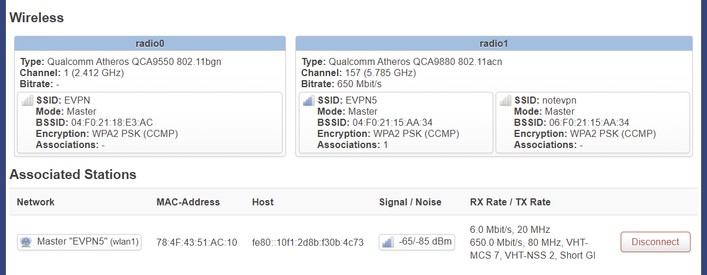
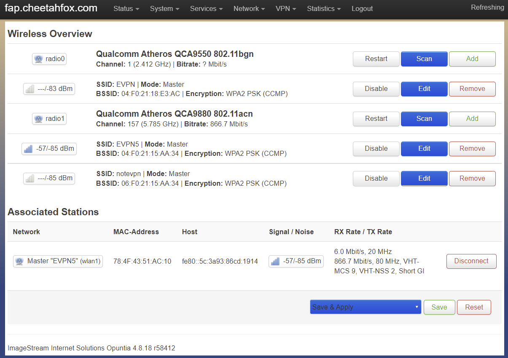
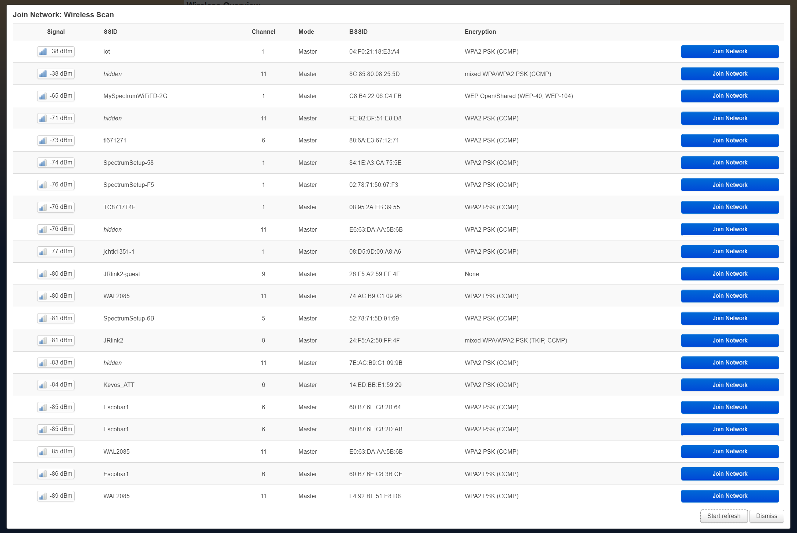
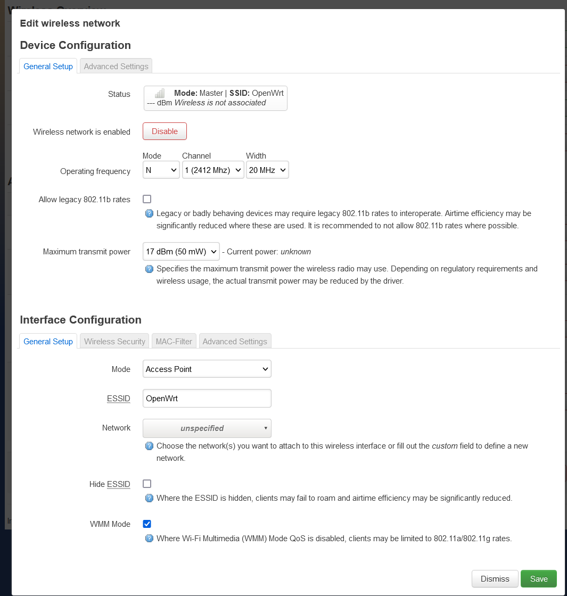

===============================
Wireless Interface Configuraion
===============================

.. contents:: Table of Contents

Wireless Basics
---------------

Opuntia supports most common WiFi standards. Current hardware platforms support the Wi-Fi 4, Wi-Fi 5 and Wi-Fi 6 standards. 

WiFi operates in three main spectrums of radio frequency. The 2.4Ghz, 5Ghz and 6Ghz bands. These are further subdivided into 
channels. Each country has specific requirements for transmit power and other restrictions. Opuntia will limit radio TX power
based on your current country code. But some restrictions like indoor vs outdoor use can not always be determined based on the
hardware platform. So please consult your local regulations.  

Below is the supported WiFi frequency ranges and channels supported by Opuntia while operating in the United States. 

+--------------------+-----------------+----------------------------------+
| Wifi Specificaion  | Frequency Range | Valid range of 20 Mhz channels   |   
+--------------------+-----------------+----------------------------------+
| WiFi 4 (802.11n)   | 2.4Ghz, 5Ghz    | 2.4Ghz: 1-11 5Ghz: 32-68, 96-177 |
+--------------------+-----------------+----------------------------------+
| WiFi 5 (802.11ac)  | 5Ghz            | 5Ghz: 32-68, 96-177              |
+--------------------+-----------------+----------------------------------+
| WiFi 6 (802.11ax)  | 2.4Ghz, 5Ghz    | 2.4Ghz: 1-11 5Ghz: 32-68, 96-177 |
+--------------------+-----------------+----------------------------------+
| WiFi 6e (802.11ax) | 6Ghz            | 6Ghz: 1-233                      |
+--------------------+-----------------+----------------------------------+

.. note:: Picking a DFS channel may cause a 60 second delay on activating the Wireless interface this is due to FCC requirements. 

Wireless Interfaces in Opuntia
------------------------------

Opuntia has extensive support for Wireless networking. Depending on your hardware platform you may have 802.11n, 802.11ac 
or 802.11ax interfaces. These interfaces can be configured in several different operating modes. 

Wireless Status
---------------

Opuntia will display Wireless on the main status page and on Wireless configuration page.

On the main status page you will see a section for each radio interfaces in your system. Depending on your hardware platform, this
may be a single radio device or multiple.

In the example below, we show a system with two radio interfaces.

In this example we see that radio0 is operating in the 2.4Ghz channel 1 band. We can see the SSID is set to "EVPN". In this example you
see that "Bitrate" is not set. This is because no clients are connected. 

In contrast; radio1 has two SSID's configured "EVPN5" and "notevpn". This radio is running in the 5Ghz band on channel 157. You do see 
a Bitrate in this case reporting 650Mbit/s. This is because we do have a client device connected to the EVPN5 SSID. This Bitrate matches
the client TX rate. 

In the Associated Stations section we can see the single connected client device. We can see useful information such as MAC-Address, Host 
Ip addresses, signal to noise, current RX/TX data rates, MCS Class and operating mode.

Wireless Overview
-----------------

To view Wireless interfaces first navigate to the Wireless Overview page.

Main Menu - *Network -> Wireless*

The Wireless Overview page will show each radio installed. Configuraion of the each radio, SSID's configured by each radio, currently 
associated stations and signal rates. 

This example shows an AP2100 with two radio's installed. The first (radio0) is in WiFi using channel #1 (2.412 Ghz). And the second radio 
(radio1) is using channel #157 in the 5Ghz range.

This screen will also show the currently associated stations. In this case, you see a single client connected to the "EVPN5" wifi SSID. 

Wireless Scanning
#################

Opuntia supports scanning for local SSID's on each radio that is installed. This can be useful for finding existing WiFi networks to join. 
The Scan is limited to the radio doing the scan. In the example below we used radio0 which is operating in the 2.4Ghz spectrum. So we 
see Wireless networks in channel 1-11. 

Wireless Configuraion
---------------------

To configured Wireless interfaces first navigate to the Wireless Overview page.

Main Menu - *Network -> Wireless*

The Wireless Overview page will show each radio installed. Configuraion of the each radio, SSID's configured by each radio, currently 
associated stations and signal rates. 

Access Point Mode
#################

Web GUI
******* 

Access Point mode is the most common configuration for Wireless devices. This mode allows wifi enabled devices to connect the Opuntia system 
and then access the network that is bridged onto the wireless Interface. 

To begin configuring a new Wireless device first find the radio interface that you want add the SSID and click the *Add* button. You will then
see the following screen. By default Access Point mode is selected. 

This screen shows the full configuration for the Wireless interface. It's broken up into two different sections, *Device Configuraion* and 
*Interface Configuraion*. 

Device Configuraion configures the hardware settings of the radio. 

.. note:: Changes to hardware level configurations will effect ALL SSID's currently configured to use this radio device.  

The general setup tab covers all of the common hardware settings. We have an *Enable* / *Disable* button that will shutdown the SSID on the 
radio interface. Operating frequency which allows for configuring the 802.11 mode (see Wireless Basics at the top of this setion for more 
information), Wi-Fi channel and channel width in Mhz. 

The last option is transmit power. This the maximum transmit power is affected by your Wi-Fi channel, Operating mode and your current operating 
region.   

Interface Configuraion configures SSID specific settings. 

This section has several tabs, general setup, wireless security, mac-filters and advanced settings. 

Client Mode
###########

802.11s Mode
############

Access Point WDS Mode
#####################

Client Mode WDS
###############

Other Modes 
###########

Opuntia supports several other Wireless interface configuration modes. These are listed below. Since their usage uncommon, at this time we 
do not plan to cover them in detail in this documentation. If you have a use case for these modes and need assistance with configuration or
usage, please contact support via e-mail support@imagestream.com or via phone at +1 (210) 569-1211. 

 Ad-Hoc
 Pseudo Ad-Hoc
 Monitor
