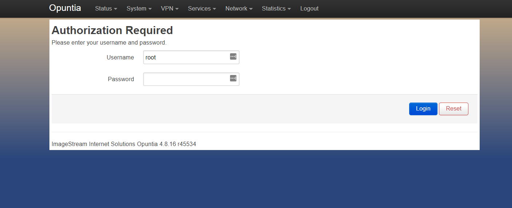
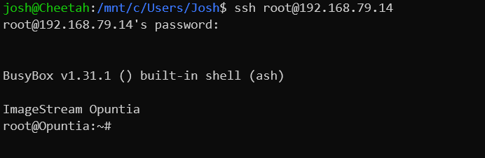

***********************
AP2100 QuickStart Guide
***********************

.. contents:: Table of Contents

The AP2100 is configured by default to allow access via several different methods. 

- Access via Ethernet using the Web Interface
- Access via Ethernet using SSH
- Access via the Local Serial Console 

Ethernet Connectivity
---------------------

The Ethernet interface on the AP2100 supports auto mdi/mdix so the interface can be connected directly to a client device
or an Ethernet switch with a standard Ethernet cable.

**IPv4**

The AP2100 has two Ethernet interfaces eth0 and eth1. The default configuration of the AP2100 is to configure eth0 as the physical 
interface for the Opuntia **Wan** interface. Due to this default configuration the AP2100 defaults to acting as a DHCP/DHCPv6 
client. It will receive an ip address from any existing DHCP servers that are present on the network connected to the Ethernet 
interface. If an IPv6 router advertiment is received on the eth0 interface it will us SLAAC to configure a Ipv6 client address. If 
a DHCPv6 server is present, the router will attempt to receive an IPv6 Prefix Delegation. 

The physical Ethernet *eth1* interface is configured as the Opuntia **Lan** interface. This interface by default is configured to 
provide a DHCP server for the 10.10.199.0/24 network.  

Once you have determined the correct IPv4 address you can then move to accessing the AP2100 via the Web GUI or via SSH. 

**IPv6**

The AP2100 will obtain an IPv6 address using DHCPv6 or SLAAC (Stateless Address Autoconfiguration) if these methods are present on the
connected network. If the AP2100 received a IPv6 Prefix Delegation on the **Wan** interface it will generate IPv6 router advertiment
packets and run a DHCPv6 server on the *eth1* interface using the received Prefix Delegation. 

The AP2100 will also always configure an IPv6 Link local address based on the MAC address([1]_) of the AP2100. This Link local 
IPv6 address is present at all times even if IPv4 and other IPv6 configurations are invalid. So the Link local address is the most 
relaible way to access the AP2100. Since this address is based on the MAC address of the Ethernet interface it is unquie to each
AP2100. An easy method to determine this address is to send a ping packet to the IPv6 "all routers" multicast address(ff02::2). 

For Linux systems this can be done using the following command assuming your Ethernet interface is "eth0". Please note that most operating 
systems require specifiying the interface in addtion to the address when using Link Local addresses. For example Linux systems would 
use the following syntax if your interface was "eth0"::
 
  ping6 ff02::2%eth0

Additionally it's possible to compute the Link Local address using the MAC address. Numerious online calculators can be used
to easily find the Link local address([2]_) using the MAC address located on the product label. Note; the AP2100 will have a 
MAC address that begins with "B0:91:37". 

Once you have determined the correct IPv6 address you can then move to accessing the AP2100 via the Web GUI or via SSH.

Web GUI Access
--------------

**Access via Ethernet using the Web Interface - IPv4**

This interface defaults to a network address range of 10.10.199.0/24 with the router configured as 10.10.199.1 
and supports DHCP client access.     

When the AP2100 is using the failback IPv4 address access the login page use the following url: `https://10.10.199.1/ <https://10.10.199.1>`_ 

The AP2100 ships with a self-signed ssl certificate. This may cause warning in when connecting to the AP2100 for the first time. These
warnings can be safely ignored for accessing the management Web GUI. 

The admin username is "**root**".  The default password is "**imagestream**". 

.. note::
   We strongly recommend that you change the default password as your first configuration change.

**Access via Ethernet using the Web Interface - IPv6**

To access the Web GUI using using IPv6 the method is similar to using IPv4. To enter a IPv6 addresses in a web browser use the following 
syntax. If we assume that you determined your Ipv6 Link Local address is "fe80::b291:37ff:fe05:1" then the correct url would be as follows::

  https://[fe80::b291:37ff:fe05:1]/

The AP2100 ships with a self-signed ssl certificate. This may cause warning in when connecting to the AP2100 for the first time. These
warnings can be safely ignored for accessing the management Web GUI. 

CLI Access via SSH 
------------------

**IPv4 & IPv6**

The AP2100 can also be accessed via SSH. Using the ip address of the AP2100 connect as user root. If the AP2100 is in failback IPv4 mode 
the ip address will be 10.10.199.1. If the AP2100 is using DHCP or DHCPv6 you need to determine which address was a assigned by looking 
at your DHCP sever. In the following screenshot the address was assigned via DHCP.  

The admin username is "**root**".  The default password is "**imagestream**". 

Cli Access via Serial Console 
-----------------------------

The EV1000 features a DE-9([3]_) connector using the Rs232 Serial standard. You will need a **Null Serial** connection to connect to this
interface. The interface will be running at a baud rate 115,200 bps and using 8 data bits; no parity bit and 1 stop bit; or commonly known 
as "115.2kbps 8n1". 

The most likely cause of problems when using the Serial interface is issues with incorrect cables. As noted above, a **Null Serial** cable is 
required.  

.. rubric:: Footnotes

.. [1] Using the RFC4862 standard for Link Local address creation 
.. [2] https://ben.akrin.com/?p=1347 Ipv6 Link Local Calculator
.. [3] The DE-9 connector is often incorrectly known as a DB-9 interface.