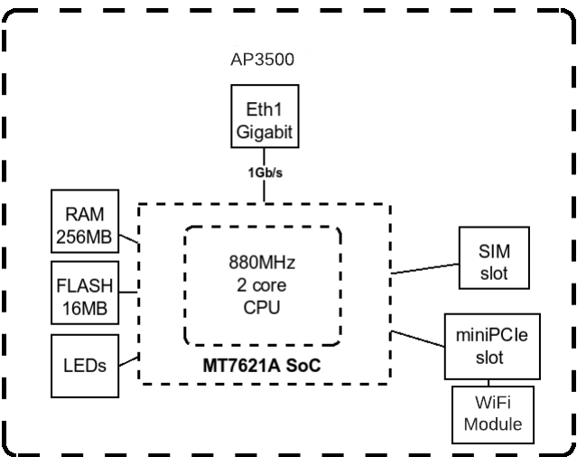
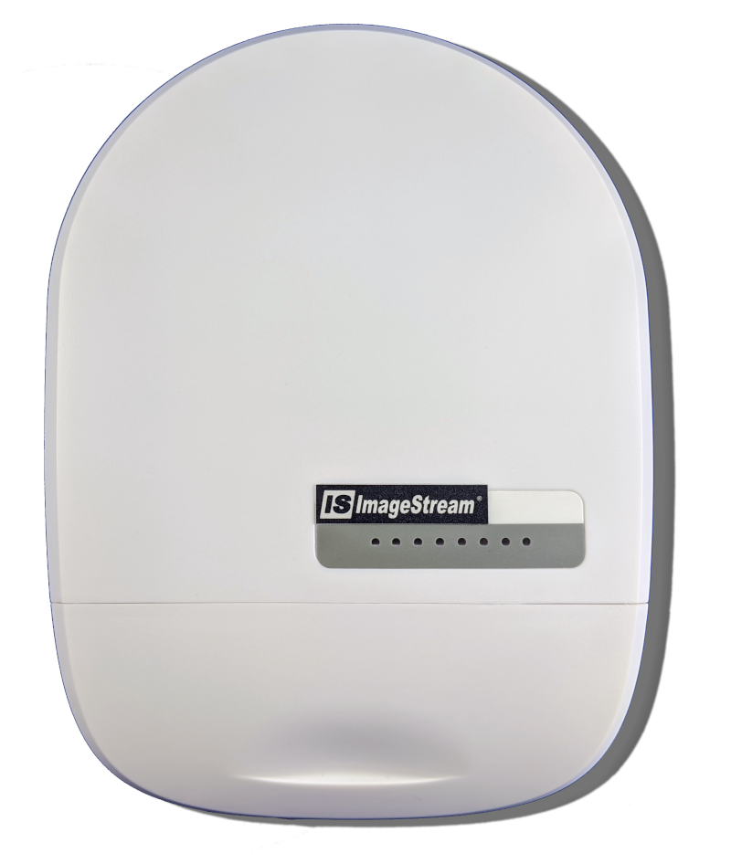

***********************
AP3500 Hardware details
***********************

.. contents:: Table of Contents

Hardware Description
--------------------

The AP3500 is a outdoor wire access point designed to be used in Point to Point or Point to Multipoint applications.
The AP3500 is designed to attach to a number of different external anntena units. These feature differing Gain, beam 
widths and mounting options for differing deplyoments.

- 90° beam width sector anntena with 9.6dBi Gain
- 60° beam width sector anntena with 13.2dBi Gain
- 30° beam width sector anntena with 18.4dBi Gain
- Point to Point dish anntena with 24.5dBi Gain
- Point to Point dish anntena with 27.5dBi Gain

**Block Diagram**

The AP3500 features a dual core 880Mhz 32bit Mips1004kc procressor. This is connected to 256MB of DDR2 memory, 16MB of NAND flash,
it features a single 1Gbit/sec Ethernet interface and a Wireless radio interface. The CPU features a network accelerator that supports
2Gbps of IPv4/6 routing, NAT and NAPT+HQoS. 

The system is powered by Ethernet PoE using the IEEE 802.3af standard. 

Visual Guide
------------

**Front View**

**Side View**

**Port View**

.. image:: ../images/AP3500-Port-view.png
   :width: 600
   :alt: Port view

