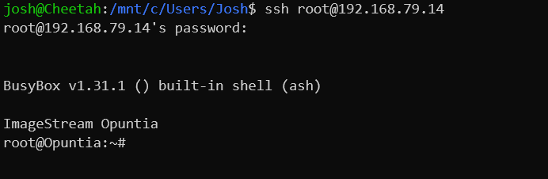

.. _EV1000-QuickStart:

**************************
EV1000 QuickStart Guide
**************************

.. contents:: Table of Contents

The EV1000 is configured by default to allow access via several different methods. 

- Access via Ethernet using the Web Interface
- Access via Ethernet using SSH
- Access via the Serial Interface

Ethernet Connectivity
---------------------

The Ethernet interface on the EV1000 supports auto mdi/mdix so the interface can be connected directly to a client device
or an Ethernet switch with a standard Ethernet cable.

The EV1000 has three Ethernet interfaces. These are marked on the back of the EV1000 as Eth0, Eth1 and Eth2. Below is a
description of the factory default configuration EV1000. It is possible to change these defaults once this unit is configured.  

**Eth0 and Eth1**

The default configuration of the EV1000 is to configure Eth0 and Eth1 as descrete interfaces. These interfaces runs in DHCP 
and DHCPv6 client mode. It will continue to try to receive an IPv4 and IPv6 address on the Wan interface until it succeeds. 
Since both interfaces are trying to obtain a valid IPv4 address and default routes; in the case where both interfaces install
a default route Eth0 will be the perfered interface.  

The Eth0 and Eth1 interface are part of the Wan Firewall Zone. It will Source Nat traffic flowing out these interfaces by default.    

**Eth2**

The Eth2 interface is configured as the default management interface. This interface is connfigured as a DHCP server. The default
ip address of this interface is 10.10.199.1/24. It will provide DHCP for the 10.10.199.0/24 network. This interface is in the
management firewall zone. 

If the EV1000 obtains an IPv6 prefix deligation using DHCPv6 on either Eth0 or Eth1; then an IPv6 network will be configured on the 
management interface.

**All Ethernet Interfaces**

The EV1000 will always configure an IPv6 Link local address based on the MAC address([1]_) of the EV1000. This Link local 
IPv6 address is present at all times even if IPv4 and other IPv6 configurations are invalid. So the Link local address is the most 
relaible way to access the EV1000. Since this address is based on the MAC address of the Ethernet interface it is unquie to each
EV1000 interface so it's often not the most convenient as you must determine the specific address. One method to determine this address 
is to send a ping packet to the IPv6 "all routers" multicast address(ff02::2). 

For Linux systems this can be done using the following command assuming your Ethernet interface is "eth0". Please note that most operating 
systems require specifiying the interface in addtion to the address when using Link Local addresses. For example Linux systems would 
use the following syntax if your interface was "eth0"::
 
  ping6 ff02::2%eth0

Additionally it's possible to compute the Link Local address using the MAC address. Numerious online calculators can be used
to easily find the Link local address([2]_) using the MAC address located on the product label. 

Once you have determined the correct IPv4 or IPv6 address you can then move to accessing the EV1000 via the Web GUI or via SSH.

Serial Connectivity
-------------------

The EV1000 features a DE-9([3]_) connector using the Rs232 Serial standard. You will need a **Null Serial** connection to connect to this
interface. The interface will be running at a baud rate 115,200 bps and using 8 data bits; no parity bit and 1 stop bit; or commonly known 
as "115.2kbps 8n1". 

The most likely cause of problems when using the Serial interface is issues with incorrect cables. As noted above, a **Null Serial** cable is 
required.  

Web GUI Access
--------------

**Access via Ethernet using the Web Interface**

The management interface (Eth2) defaults to a network address range of 10.10.199.0/24 with the router configured as 10.10.199.1 
and supports DHCP client access. If connecting via this interface the address access the login page is the following 
url: `https://10.10.199.1/ <https://10.10.199.1>`_ 

Additionally the EV1000 can be accessed on the Eth0 and Eth1 either using the IP addresses assigned via DHCP/DHCPv6 or Ipv6 Link Local
address. 

The EV1000 ships with a self-signed ssl certificate. This may cause warning in when connecting to the EV1000 for the first time. These
warnings can be safely ignored for accessing the management Web GUI. 

The admin username is "**root**".  The default password is "**imagestream**". 

.. note::
   We strongly recommend that you change the default password as your first configuration change.

.. image:: ../images/Opuntia-default-login.png
  :width: 600
  :alt: Screenshot of the Opuntia login page

**Access via Ethernet using the Web Interface: Link Local details**

To access the Web GUI using using the IPv6 Link Local the method is similar to using IPv4. To enter a IPv6 addresses in a web browser use the following syntax. 
If we assume that you determined your Ipv6 Link Local address is "fe80::b291:37ff:fe05:1" then the correct url would be as follows::

  https://[fe80::b291:37ff:fe05:1]/

The EV1000 ships with a self-signed ssl certificate. This may cause warning in when connecting to the EV1000 for the first time. These
warnings can be safely ignored for accessing the management Web GUI. 

CLI Access via SSH
------------------

**IPv4 & IPv6**

The EV1000 can also be accessed via SSH. Using the ip address of the EV1000 connect as user root. If you are connecting to the management interface of the EV1000 
the ip address will be 10.10.199.1. If you are connecting to either Eth0 or Eth1 the EV1000 will be using DHCP or DHCPv6 and you will need to determine which 
address was a assigned by looking at your DHCP sever. In the following screenshot the address was assigned via DHCP.  

The admin username is "**root**".  The default password is "**imagestream**". 

CLI Access via the Serial Interface
-----------------------------------

The EV1000 has a built in DE-9 Rs232 Interface. When connecting via the Serial Interface; to access the CLI no password is currently required (as of Opuntia version 
4.8.16). Just connect using this interface (for details see above) and press the "enter" key. 

.. rubric:: Footnotes

.. [1] Using the RFC4862 standard for Link Local address creation 
.. [2] https://ben.akrin.com/?p=1347 Ipv6 Link Local Calculator
.. [3] The DE-9 connector is often incorrectly known as a DB-9 interface. 