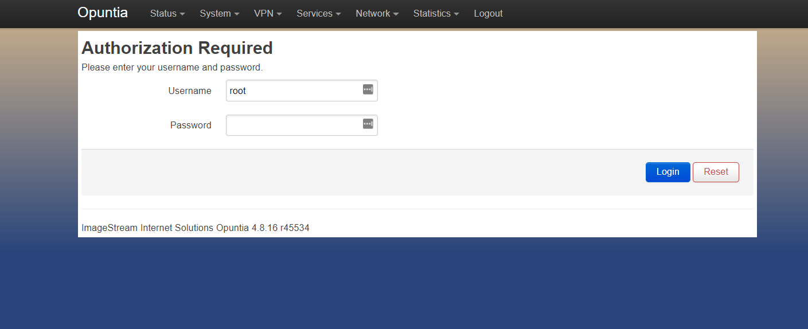

*****************************
Rebel Router QuickStart Guide
*****************************

 The Rebel Router (RR1000) is configured by default to allow access via several different methods. 

 - Access via Ethernet using SSH
 - Access via Ethernet using the Web Interface
 - Access using the built-in console port  

.. contents:: Table of Contents

.. Warning:: The documentation for the RR1000 is still a work in progress. 

The RR1000 is configured by default to allow access via several different methods. 

- Access via Ethernet using the Web Interface
- Access via Ethernet using SSH
- Access via the Serial Interface

Ethernet Connectivity
---------------------

The Ethernet interface on the RR1000 supports auto mdi/mdix so the interface can be connected directly to a client device
or an Ethernet switch with a standard Ethernet cable.

**IPv4**

The RR1000 has a single Ethernet interface. The default configuration of the RR1000 is to bridge the Ethernet interface 
with the wireless radio. Due to this default configuration the RR1000 defaults to acting as a DHCP client. It will receive 
an ip address from any existing DHCP servers that are present on the network connected to the Ethernet interface. 

If the RR1000 fails to obtain an DHCP lease within the first 60 seconds; the RR1000 will switch modes and it will assign 10.10.199.1/24 
to the Ethernet interface. In this failback mode the RR1000 will then be accessable using this self-assigned address.

Once you have determined the correct IPv4 address you can then move to accessing the RR1000 via the Web GUI or via SSH. 

**IPv6**

The RR1000 will obtain an IPv6 address using DHCPv6 or SLAAC (Stateless Address Autoconfiguration) if these methods are present on the
connected network. 

The RR1000 will always configure an IPv6 Link local address based on the MAC address([1]_) of the RR1000. This Link local 
IPv6 address is present at all times even if IPv4 and other IPv6 configurations are invalid. So the Link local address is the most 
relaible way to access the RR1000. Since this address is based on the MAC address of the Ethernet interface it is unquie to each
RR1000. An easy method to determine this address is to send a ping packet to the IPv6 "all routers" multicast address(ff02::2). 

For Linux systems this can be done using the following command assuming your Ethernet interface is "eth0". Please note that most operating 
systems require specifiying the interface in addtion to the address when using Link Local addresses. For example Linux systems would 
use the following syntax if your interface was "eth0"::
 
  ping6 ff02::2%eth0

Additionally it's possible to compute the Link Local address using the MAC address. Numerious online calculators can be used
to easily find the Link local address([2]_) using the MAC address located on the product label. 

Once you have determined the correct IPv6 address you can then move to accessing the RR1000 via the Web GUI or via SSH.

Serial Connectivity
-------------------

The RR1000 features a DE-9([3]_) connector using the Rs232 Serial standard. You will need a **Null Serial** connection to connect to this
interface. The interface will be running at a baud rate 115,200 bps and using 8 data bits; no parity bit and 1 stop bit; or commonly known 
as "115.2kbps 8n1". 

The most likely cause of problems when using the Serial interface is issues with incorrect cables. As noted above, a **Null Serial** cable is 
required.  

Web GUI Access
--------------

**Access via Ethernet using the Web Interface - IPv4**

This interface defaults to a network address range of 10.10.199.0/24 with the router configured as 10.10.199.1 
and supports DHCP client access.     

When the RR1000 is using the failback IPv4 address access the login page use the following url: `https://10.10.199.1/ <https://10.10.199.1>`_ 

The RR1000 ships with a self-signed ssl certificate. This may cause warning in when connecting to the RR1000 for the first time. These
warnings can be safely ignored for accessing the management Web GUI. 

The admin username is "**root**".  The default password is "**imagestream**". 

.. note::
   We strongly recommend that you change the default password as your first configuration change.

**Access via Ethernet using the Web Interface - IPv6**

To access the Web GUI using using IPv6 the method is similar to using IPv4. To enter a IPv6 addresses in a web browser use the following syntax. 
If we assume that you determined your Ipv6 Link Local address is "fe80::b291:37ff:fe05:1" then the correct url would be as follows::

  https://[fe80::b291:37ff:fe05:1]/

The RR1000 ships with a self-signed ssl certificate. This may cause warning in when connecting to the RR1000 for the first time. These
warnings can be safely ignored for accessing the management Web GUI. 

CLI Access via SSH
------------------

**IPv4 & IPv6**

The RR1000 can also be accessed via SSH. Using the ip address of the RR1000 connect as user root. If the RR1000 is in failback IPv4 mode the ip address
will be 10.10.199.1. If the RR1000 is using DHCP or DHCPv6 you need to determine which address was a assigned by looking at your DHCP sever. In the following 
screenshot the address was assigned via DHCP.  

The admin username is "**root**".  The default password is "**imagestream**". 

.. image:: ../images/Opuntia-default-login-ssh.png
   :width: 600
   :alt: Screenshot of the SSH Login

CLI Access via the Serial Interface

The RR1000 has a built in DE-9 Rs232 Interface. When connecting via the Serial Interface; to access the CLI no password is currently required (as of Opuntia version 
4.8.16). Just connect using this interface (for details see above) and press the "enter" key. 

.. rubric:: Footnotes

.. [1] Using the RFC4862 standard for Link Local address creation 
.. [2] https://ben.akrin.com/?p=1347 Ipv6 Link Local Calculator
.. [3] The DE-9 connector is often incorrectly known as an DB-9 interface. 