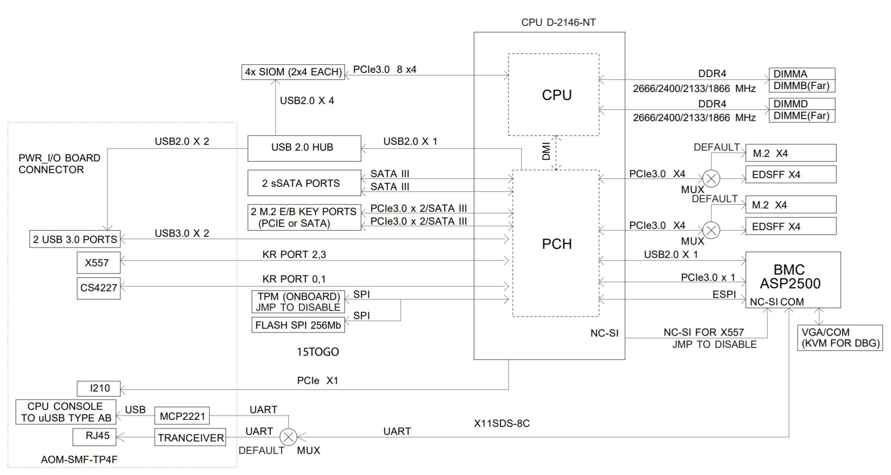
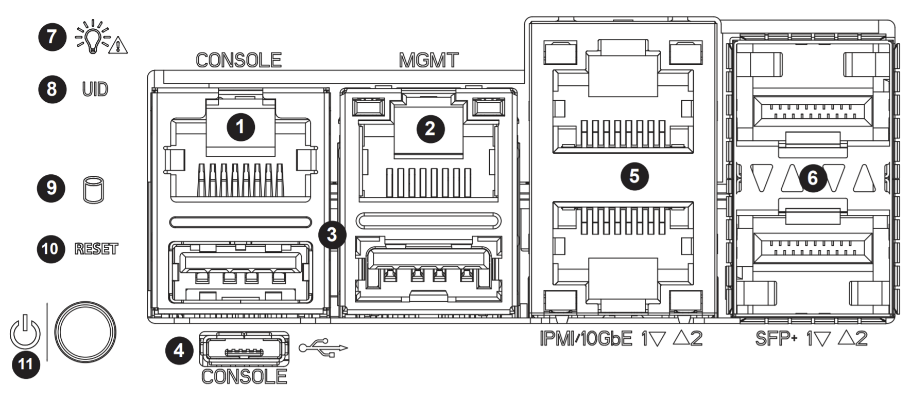

*******************************
Samurai Router Hardware Details
*******************************

.. contents:: Table of Contents

Samurai Router
--------------

The Samurai Router is the top of the line ImageStream Router. The Samurai Router is designed to provide reliable high performace
layer 3 routing for demanding applications.

Key features include
 
 - Powerful 8 Core CPU
 - Two 10Gbase-T 10Gbit Interfaces
 - Two Sfp+ 10Gbit Interfaces
 - Redundant AC Power Supplies
 - four front pannel expansion slots 

The four front pannel expansion slots allow any combination of the following expansion cards.

Addon Front pannel Options
 - 8 port GbE Rj-45 Interfaces 
 - 4 port GbE SFP Interfaces
 - 2 port 10Gbase-T Rj-45 Interfaces
 - 2 port 25 Gbit SFP28 Interfaces

These options allow the Samurai Router to be configured for wide variety of deployment options. 

**System Block Diagram**

Built-in Interfaces
-------------------

.. table:: Front Ports and LEDs

   +-----------+-----------------+------------------+----------------+----------------+
   | Diagram # | Case Label      | Opuntia Dev Name | Linux Dev Name | Description    |
   +===========+=================+==================+================+================+
   | 1         | Console         | n/a              | /dev/ttyS0     | Serial Console |
   +-----------+-----------------+------------------+----------------+----------------+
   | 2         | MGMT            | mgmt             | enp2s0         | 1Gbit Ethernet |
   +-----------+-----------------+------------------+----------------+----------------+
   | 3         | USB             | n/a              | n/a            | USB 3.0 Type A |
   +-----------+-----------------+------------------+----------------+----------------+
   | 4         | Console USB     | n/a              | n/a            | USB Console    |
   +-----------+-----------------+------------------+----------------+----------------+
   | 5 (bottom)| IPMI/10GbE 1    | mgmt_10g         | enp183s0f2     | 10Gbit Ethernet|
   +-----------+-----------------+------------------+----------------+----------------+
   | 5 (top)   | 10GbE 2         | eth2             | enp183s0f3     | 10Gbit Ethernet|
   +-----------+-----------------+------------------+----------------+----------------+
   | 6 (bottom)| SFP+ 1          | sfp1             | enp183s0f1     | SFP+ Interface |
   +-----------+-----------------+------------------+----------------+----------------+
   | 6 (top)   | SFP+ 2          | sfp2             | enp183s0f0     | SFP+ Interface |
   +-----------+-----------------+------------------+----------------+----------------+
   | 7         | Status LED      |                  |                | Status LED     |
   +-----------+-----------------+------------------+----------------+----------------+
   | 8         | UID LED         |                  |                | UID LED        |
   +-----------+-----------------+------------------+----------------+----------------+
   | 9         | HDD LED         |                  |                | HDD LED        |
   +-----------+-----------------+------------------+----------------+----------------+
   | 10        | Reset LED       |                  |                | Reset LED      |
   +-----------+-----------------+------------------+----------------+----------------+
   | 11        | Power LED/Button|                  |                | Status LED     |
   +-----------+-----------------+------------------+----------------+----------------+

.. note:: The Managment and Managment-10g interfaces may be used as normal interfaces in Opuntia. But the Managment-10 Interface will always expose the system BMC IPMI. So care should be taken to provide the needed security if using this interface.

The managment interface will be configured with a static 

The status LED has several different operating modes depending on the current system status. This table shows the different
LED apperance and system status.

.. table:: Status LED

    +--------------------------+-----------------------------------------+
    | LED Apperance            | Description                             |
    +==========================+=========================================+
    | Solid Green              | System powered on operating normally    |
    +--------------------------+-----------------------------------------+
    | Blinking Green           | System is shutting down                 |
    +--------------------------+-----------------------------------------+
    | Solid Red                | System is overheating                   |
    +--------------------------+-----------------------------------------+
    | 1 Second Blinking Red    | System Fan Failure                      |
    +--------------------------+-----------------------------------------+
    | 1/4 Second Blinking Red  | System Power Failure                    |
    +--------------------------+-----------------------------------------+
    | Solid Blue               | System Local UID enabled                |
    +--------------------------+-----------------------------------------+
    | 1 Second Blinking Blue   | System Remote UID enabled               |
    +--------------------------+-----------------------------------------+
    | Not lit                  | System is powered off                   |
    +--------------------------+-----------------------------------------+
    
.. note:: The system UID status is enabaled in the IMPI Interface. 
